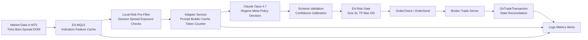
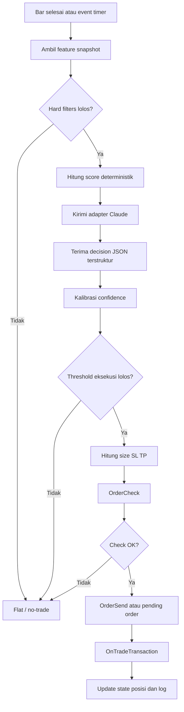

# Rancangan Bot Trading Berbasis Claude Opus 4.7 di MetaTrader 5

## Ringkasan eksekutif

Claude Opus 4.7 **layak dipakai sebagai “backbone” nalar dan meta-policy** untuk bot trading di MT5, tetapi **tidak layak dijadikan pengambil keputusan mikro per-tick**. Alasan utamanya ada pada kombinasi tiga fakta teknis: model ini diposisikan Anthropic sebagai model paling kapabel untuk reasoning kompleks dengan **latensi komparatif “moderate”**, context window hingga **1 juta token**, dan API Messages yang **stateless**; sementara di sisi MT5, integrasi HTTP bawaan `WebRequest()` bersifat **sinkron**, hanya bisa dipanggil dari **Expert Advisor/script** dan **tidak bisa dijalankan di Strategy Tester**. Artinya, arsitektur yang sehat bukan “EA memanggil Claude langsung untuk tiap tick”, melainkan **EA MT5 untuk eksekusi + adapter service lokal/terdekat untuk Claude + harness riset/replay terpisah untuk backtest**. citeturn11search0turn8view0turn32view1turn14view0

Secara praktis, pendekatan paling kuat adalah menjadikan Claude sebagai **lapisan penentu rezim pasar, peanthropic_modelnimbang konflik sinyal, pembuat keputusan diskret yang terstruktur**, dan penghasil *confidence/explanation* yang kemudian masih harus lolos **risk gate** deterministik di MT5. Gunakan Claude untuk menjawab pertanyaan seperti “apakah kondisi ini lebih mirip trend breakout, pullback continuation, atau mean reversion?”, bukan “buy sekarang pada tick ini atau tidak.” Pendekatan itu cocok dengan tool-use Anthropic yang memang dirancang agar model mengembalikan panggilan terstruktur yang dieksekusi aplikasi Anda, dan dengan praktik MQL5 yang lebih aman bila order placement tetap berada di dalam EA. citeturn8view4turn8view7turn8view9turn32view0

Keterbatasan terpenting untuk proyek ini adalah **backtesting**. Karena `WebRequest()` tidak tersedia di Strategy Tester, strategi live yang bergantung pada panggilan Claude **tidak bisa diuji secara native di tester dengan path yang sama**. Solusi yang paling dapat dipertanggungjawabkan adalah membangun **mode replay**: fitur pasar direkam/dihitung offline, keputusan Claude disimpan sebagai *decision ledger* bertimestamp, lalu keputusan itu direplay di MT5 tester; atau, untuk validasi yang lebih ketat, kebijakan Claude didistilasi menjadi policy lokal yang deterministik untuk keperluan tester. Jika batasan ini diabaikan, hasil backtest akan tampak “rapi” tetapi tidak mewakili perilaku sistem produksi. citeturn14view0turn25view1turn25view0turn29search0

Dengan asumsi bot ini ditujukan untuk **FX/CFD intraday M5–H1 atau swing H1–D1**, rekomendasi saya adalah: **multi-timeframe features**, kombinasi indikator yang *orthogonal* (trend + momentum + volatility + volume proxy + structure), Claude dalam mode **adaptive thinking** hanya untuk kasus ambigu atau evaluasi periodik rezim, dan eksekusi order sepenuhnya dikontrol risk engine di MT5. Jalur ini paling realistis untuk mencapai sistem yang tetap bisa diaudit, diuji, dan dioperasikan secara stabil. citeturn8view0turn35view0turn28search0turn24view0

## Asumsi dan batasan

Laporan ini harus membuat beberapa asumsi karena Anda belum menetapkan **kelas aset**, **timeframe utama**, **broker/execution mode**, **ketersediaan real volume/DOM**, **batasan regulasi/jurisdiksi**, serta **target frekuensi trading**. Saya mengasumsikan sistem dipakai untuk instrumen yang umum tersedia di MT5 seperti FX, indeks CFD, komoditas, atau futures/saham yang disuplai broker/exchange melalui MT5; dan bahwa tujuan utamanya adalah **automated discretionary system** berfrekuensi rendah sampai menengah, bukan HFT. Klaim teknis di bawah diprioritaskan dari dokumentasi resmi Anthropic, MQL5, dan MetaTrader 5. citeturn23search5turn35view2turn29search0

Ada tiga batasan desain yang perlu Anda perlakukan sebagai *hard constraints*. Pertama, Anthropic mengharuskan request API menyertakan autentikasi (`x-api-key` atau `Authorization`), `anthropic-version`, dan `content-type: application/json`; SDK resmi menangani ini otomatis dan juga memberi *retry/error handling*. Kedua, Messages API bersifat stateless, sehingga riwayat lengkap atau ringkasan state harus dikelola aplikasi Anda sendiri. Ketiga, Opus 4.7 tidak lagi memakai mode extended thinking lama; untuk reasoning tambahan gunakan **adaptive thinking**, dan prefill tidak didukung pada Opus 4.7. citeturn35view2turn32view0turn32view1turn8view0

Batasan lain berasal dari MT5. `WebRequest()` bersifat sinkron, menahan thread EA sampai respons datang, tidak tersedia untuk indikator, dan tidak bisa dipakai di Strategy Tester. MT5 juga menerapkan **allowlist alamat/IP** untuk `Socket*` dan `WebRequest`, dan alamat itu **tidak bisa ditambahkan secara programatis**. Ini berarti keamanan dan operasional produksi jauh lebih baik bila kredensial Anthropic disimpan di **adapter service**, bukan di source code EA/MQL5. citeturn14view0turn15view0

Pertanyaan terbuka yang secara nyata mengubah desain implementasi adalah: apakah broker Anda memakai **netting** atau **hedging**, apakah instrumen menyediakan **real volume** dan **Depth of Market**, apakah Anda akan trading hanya di **bar close** atau intra-bar, dan apakah Anda perlu deployment 24/7 di VPS generik atau cukup mengandalkan virtual hosting MT5. MT5 membedakan jelas mode retail netting dan retail hedging, serta DOM memang hanya tersedia untuk sebagian simbol. citeturn17view3turn17view4turn26search9

## Arsitektur teknis

Arsitektur yang saya rekomendasikan adalah **tiga lapis**: **execution plane** di MT5, **decision plane** di adapter Claude, dan **research/replay plane** untuk backtest serta walk-forward. Execution plane adalah EA MQL5 yang berjalan di chart, memegang handle indikator, membaca timeseries, menjalankan risk rules, mengeksekusi `OrderCheck()`/`OrderSend()` atau `CTrade`, dan merekonsiliasi hasil melalui `OnTradeTransaction()`. Decision plane adalah service eksternal—paling praktis Python—yang memegang API key Anthropic, mengelola prompt template, token counting, prompt caching, schema validation, retry, rate limiting, dan *decision logging*. Research plane memakai package Python resmi `MetaTrader5` untuk mengambil bars/ticks/market book dari terminal lewat IPC, lalu menghasilkan *decision ledger* yang dapat direplay untuk tester. citeturn4search0turn8view7turn8view8turn21search2turn32view0turn35view2

Secara integrasi, **memanggil Anthropic langsung dari MQL5** memang mungkin secara teknis lewat `WebRequest()`, tetapi itu biasanya pilihan yang lebih buruk untuk produksi: Anda harus mengelola header, API key, timeout sinkron, JSON parsing, rate-limit handling, dan Anda tetap tidak bisa menguji path itu di Strategy Tester. Sebaliknya, bila EA hanya memanggil **adapter lokal**—misalnya `http://127.0.0.1:8000/decision`—maka kredensial, prompt, caching, dan observabilitas tetap berada di layer yang lebih fleksibel. Anthropic sendiri menyediakan SDK resmi lintas bahasa dengan dukungan streaming, retry, dan error handling; semua request API Claude juga harus mengarah ke endpoint REST `https://api.anthropic.com`. citeturn14view0turn15view0turn32view0turn35view2

Untuk produksi, saya menyarankan **EA tetap menjadi satu-satunya pihak yang boleh mengirim order ke broker**. Adapter sebaiknya tidak mengirim order ke akun MT5 secara independen, walaupun package Python MT5 mendukung `order_send()` dan `order_check()`. Pemisahan ini mencegah *split-brain execution* dan membuat audit jauh lebih bersih: MT5 menjadi “source of truth” posisi/order; adapter hanya memberi sinyal terstruktur. Package Python MT5 sangat berguna untuk riset, pengumpulan data, dan batch evaluation, tetapi untuk trading live yang dapat diaudit, final say harus tetap di EA. citeturn4search3turn4search6turn8view7turn21search2

Dari sisi **hosting**, yang paling penting untuk PnL nyata biasanya adalah kedekatan terminal MT5 ke server broker, bukan mengejar milidetik ke API Claude. MetaTrader menyediakan virtual hosting 24/7 dengan delay minimal untuk robot trading; jika Anda membutuhkan service adapter kustom, praktik terbaiknya adalah menaruh **terminal MT5 dan adapter pada host yang sama** atau setidaknya subnet/region yang sama, lalu membiarkan adapter keluar ke Anthropic lewat internet publik dengan TLS. Jika penggunaan API Claude sudah produksi dan sensitif terhadap prediktabilitas kapasitas, pertimbangkan service tier Anthropic yang memang diposisikan untuk workflow produksi. citeturn30search0turn30search4turn9search14

Secara latensi, saya sarankan target engineering berikut sebagai **batas desain**, bukan fakta vendor: kalkulasi fitur lokal <10 ms, round trip EA→adapter lokal <5 ms, inferensi Claude p95 tetap jauh di bawah horizon keputusan Anda. Karena Opus 4.7 diberi label latensi “moderate”, dan rate limits Anthropic diukur dalam RPM/ITPM/OTPM, maka sistem ini **tidak cocok untuk strategi tick scalping atau HFT**. Gunakan pada **bar-close M1/M5 ke atas**, atau lebih ideal lagi M5/H1/D1, dengan Claude dipanggil saat bar selesai atau saat event tertentu, bukan pada setiap tick. Untuk kebutuhan order-path yang sangat sensitif waktu, MQL5 punya `OrderSendAsync()`, tetapi itu justru menggarisbawahi bahwa layer LLM harus berada **di hulu**, bukan di jalur HFT langsung. citeturn11search0turn8view2turn16view7



Di dalam adapter, gunakan **native Claude API**, bukan compatibility layer OpenAI, bila Anda perlu output yang sangat terstruktur. Anthropic sendiri mencatat bahwa compatibility layer OpenAI tidak menjamin schema conformance secara ketat, sedangkan native Claude API mendukung structured outputs / strict tool use. Untuk trading, idealnya Claude tidak menghasilkan teks bebas, melainkan objek seperti:

- `action`: `buy|sell|flat`
- `regime`: `trend|breakout|mean_reversion|unclear`
- `confidence_raw`: `0..1`
- `horizon_bars`
- `stop_model`: `atr|structure`
- `invalidated_if`
- `reasons_short[]`

Dengan format semacam itu, EA tidak perlu “menafsirkan bahasa”; EA hanya menjalankan aturan. citeturn37search5turn39search1turn39search10turn39search9

Keamanan sebaiknya didesain **fail-closed**. Simpan API key hanya di environment/secret store adapter; jangan pernah di source `.mq5`, `.set`, atau terminal log. Manfaatkan Messages API, prompt caching, dan token counting yang semuanya memenuhi syarat Zero Data Retention bila organisasi Anda memiliki pengaturan ZDR; batasi pula allowlist MT5 hanya ke alamat adapter lokal. Untuk prompt panjang yang statis—system prompt, policy book, definisi schema—aktifkan **prompt caching**; untuk mencegah pembengkakan biaya atau limit, panggil **token counting** lebih dulu. citeturn32view1turn31search3turn35view0turn35view2

## Indikator dan fitur model

Secara prinsip, jangan membangun bot di atas **satu indikator**. Claude akan jauh lebih berguna bila ia menerima **fitur yang saling ortogonal**: satu blok trend, satu blok momentum, satu blok volatility, satu blok volume/order-flow proxy, dan satu blok structure/support-resistance. MT5 menyediakan indikator teknikal built-in melalui handle seperti `iMA`, `iADX`, `iRSI`, `iMACD`, `iATR`, `iBands`, `iIchimoku`, `iStochastic`, `iOBV`, `iMFI`, `iMomentum`, `iCCI`, `iSAR`, `iFractals`; seluruh handle itu dibaca lewat `CopyBuffer()` dan sebaiknya dibuat di `OnInit()` lalu dilepas ketika tidak lagi dibutuhkan. Untuk indikator non-bawaan—misalnya pivot points, Donchian, anchored VWAP, atau dominant-cycle estimator—pakailah `iCustom()` atau hitung di adapter/Python. citeturn5search0turn27search0turn27search1turn27search2turn5search12

| Kategori | Indikator / proxy | Status di MT5 | Fungsi utama | Starting prior yang disarankan | Kelemahan utama |
|---|---|---|---|---|---|
| Trend | EMA / SMA | Built-in (`iMA`) | Arah dasar, slope, bias multi-timeframe | 20/50/200 untuk swing; 10/20/50 untuk intraday | Terlambat saat regime berubah |
| Trend | ADX + DI | Built-in (`iADX`) | Kekuatan trend, filter breakout vs chop | 14; trend kuat mulai area 20–25 | Tidak memberi arah sendiri tanpa +DI/-DI |
| Trend / structure | Ichimoku | Built-in (`iIchimoku`) | Trend, support/resistance dinamis, cloud regime | 9/26/52 | Padat dan kurang efisien bila digabung berlebihan |
| Trend trailing | Parabolic SAR | Built-in (`iSAR`) | Trailing / stop logic | 0.02 / 0.2 | Sangat mudah whipsaw di pasar sideway |
| Momentum | RSI | Built-in (`iRSI`) | Overbought/oversold, momentum reversal | 14 untuk umum; 2–7 untuk mean reversion cepat | Sering “stuck” pada trend kuat |
| Momentum | MACD / OsMA | Built-in (`iMACD`, `iOsMA`) | Momentum trend dan perubahan percepatan | 12/26/9 | Lambat untuk reversal cepat |
| Momentum | Stochastic | Built-in (`iStochastic`) | Mean reversion / exhaustion | 14/3/3 | Banyak sinyal palsu di trend besar |
| Momentum | CCI | Built-in (`iCCI`) | Deviasi harga dari rata-rata | 20 | Sensitif pada noise |
| Momentum | Momentum ROC proxy | Built-in (`iMomentum`) | Kecepatan perubahan harga | 14 | Redundan bila fitur return sudah kuat |
| Volatility | ATR | Built-in (`iATR`) | Stop distance, sizing, regime vol | 14 | Tidak memberi arah |
| Volatility | Bollinger Bands | Built-in (`iBands`) | Mean reversion, squeeze, band width | 20, deviasi 2 | Band touch bukan sinyal mandiri |
| Volatility | StdDev | Built-in (`iStdDev`) | Volatility murni, tanpa envelope | 20 | Kurang intuitif untuk eksekusi |
| Volume proxy | OBV | Built-in (`iOBV`) | Konfirmasi arah berbasis volume | 20-bar slope / z-score | Lemah jika volume broker buruk |
| Volume proxy | MFI | Built-in (`iMFI`) | Harga + volume flow | 14 | Bergantung kualitas volume |
| Volume proxy | AD line | Built-in (`iAD`) | Akumulasi/distribusi berbasis close location & volume | 20–50 slope | Sama-sama bergantung kualitas volume |
| Structure | Fractals | Built-in (`iFractals`) | Swing high/low, breakout level | 2-bar fractal default | Lag konfirmasi |
| Support/resistance | Pivot points | Custom (`iCustom`/Python) | Level sesi harian | Daily pivots + S/R1–S/R2 | Kurang relevan pada gap besar atau event regime |
| Support/resistance | Donchian highs/lows | Custom | Breakout / channel | 20 & 55 | Rentan fake breakout |
| Structure / fair value | VWAP / anchored VWAP | Umumnya custom | Mean reversion / fair-value pullback | Session VWAP atau event-anchored | Lebih cocok pada instrumen bervolume nyata |
| Cycle | Dominant cycle / Ehlers-style estimator | Custom | Menentukan periode osilator adaptif | Cari pada lag 10–60 | Mudah overfit jika tidak distabilkan |
| Order-flow proxy | DOM imbalance / book slope | Built-in market depth API | Menilai tekanan antrian bid/ask | Top 3–5 level | DOM hanya tersedia pada sebagian simbol |
| Order-flow proxy | Tick volume, spread jump, signed tick imbalance | Built-in series | Proxy mikrostruktur saat DOM tidak ada | Rolling 50–200 tick/bar | Hanya proksi, bukan tape sesungguhnya |

Catatan: tabel ini adalah sintesis implementasi. Keberadaan fungsi, parameterisasi dasar, dan kemampuan akses data didukung oleh dokumentasi resmi MQL5/MT5 untuk indikator built-in, `CopyBuffer`, `iCustom`, `tick_volume`/`real_volume`, dan market depth. Nilai starting prior seperti MACD **12/26/9**, Ichimoku **9/26/52**, dan SAR **0.02/0.2** selaras dengan contoh parameter standar pada dokumentasi MT5. citeturn5search9turn5search7turn5search3turn5search10turn5search13turn6search0turn5search8turn6search4turn6search2turn5search6turn5search2turn5search11turn5search5turn27search15turn6search5turn6search3turn26search7turn26search9turn40search0turn40search1turn40search2turn41search0

Untuk **kombinasi indikator**, saya merekomendasikan tiga stack inti. Stack pertama adalah **trend breakout**: EMA slope, ADX, breakout 20-bar high/low, ATR percentile, dan konfirmasi volume proxy. Stack kedua adalah **mean reversion**: Bollinger Band z-score, RSI cepat, jarak ke EMA/VWAP yang dinormalisasi ATR, dan syarat ADX rendah. Stack ketiga adalah **swing continuation**: bias Daily/H4 dengan EMA 50/200 atau Ichimoku cloud, momentum MACD/RSI, lalu entry pada pullback ke support dinamis. Claude sebaiknya tidak menghitung ulang indikator-indikator itu; Claude hanya menerima snapshot fitur dan memutuskan **rezim + prioritas strategi**. citeturn5search0turn8view4turn32view1

Untuk **FX spot/CFD**, perlakukan volume sebagai **proxy**, bukan kebenaran absolut, karena MT5 memang memisahkan `tick_volume` dan `real_volume`, dan `real_volume` hanya berguna bila broker/exchange memasoknya. Pada instrumen exchange yang memberi DOM dan real volume, layer order-flow boleh diaktifkan: imbalance best bid/ask, cumulative depth top-N levels, depth slope, book replenishment rate, dan spread response. Bila DOM tidak tersedia, turunkan bobot order-flow dan fokus pada spread, tick imbalance, serta perubahan tick volume. citeturn23search0turn6search1turn26search9turn26search7

Pada kategori **cycle**, saya tidak menyarankan mencoba “mencari Holy Grail oscillator period” dengan brute force. MT5 tidak menyediakan satu indikator dominant-cycle baku di reference built-in, jadi cara yang lebih disiplin adalah membuat **custom cycle features** lewat `iCustom()` atau adapter Python: autocorrelation peak lag, rolling periodogram peak, rasio power band-pass, atau *adaptive oscillator period* yang dibatasi pada rentang konservatif. Bukan indikator cycle-nya yang penting, tetapi fungsinya: **mengadaptasi parameter osilator** sehingga misalnya RSI/Stochastic tidak memakai period tetap saat pasar berpindah dari chop ke momentum. citeturn5search12turn27search2

Dari sisi **feature engineering**, gunakan minimal tiga horizon: **execution timeframe**, **context timeframe**, dan **regime timeframe**. Contoh intraday: M5 untuk entry, M15 untuk context, H1 untuk regime. Contoh swing: H1 untuk entry, H4 untuk context, D1 untuk regime. Gunakan lookback yang bertingkat: 20 bar untuk mikrostruktur cepat, 50–100 bar untuk structure, 200 bar untuk regime. Karena MQL5 timeseries berurutan dari sekarang ke masa lalu, dan `CopyBuffer()`/`CopyRates()` memakai index 0 sebagai bar saat ini, keputusan produksi sebaiknya berbasis **completed bar**—umumnya mulai dari shift 1—agar tidak terjadi leakage dari bar yang belum selesai. citeturn27search0turn27search6turn4search1turn4search4

Fitur yang paling berguna untuk LLM biasanya bukan raw OHLC panjang, melainkan **ringkasan numerik yang padat**. Saya menyarankan schema input ke Claude seperti berikut:

- metadata: `symbol`, `execution_tf`, `context_tf`, `regime_tf`
- market state: spread, session, hari/jam, apakah trading diizinkan
- trend block: EMA slopes, cross distance, ADX, cloud state
- momentum block: RSI, MACD histogram, Stochastic state, deltas
- volatility block: ATR, realized vol, Bollinger width percentile
- volume/order-flow block: OBV slope, MFI, tick/real volume percentile, DOM imbalance bila ada
- structure block: distance ke fractal high/low, channel breakout distance, pivot/VWAP distance
- portfolio block: posisi terbuka, exposure, DD berjalan, risk budget tersisa
- recent context: return 3/5/10/20 bar, wick/body features, false-break count

Kemudian normalkan mayoritas fitur dengan salah satu dari tiga cara: **z-score rolling**, **ATR normalization**, atau **percentile rank**, agar Claude melihat angka lintas simbol/timeframe dalam skala yang lebih konsisten. Karena Anthropic menyediakan **token counting** dan prompt caching, Anda bisa menjaga payload tetap singkat dan murah tanpa kehilangan konteks penting. citeturn35view0turn31search3turn32view1

## Logika sinyal, risiko, dan eksekusi

Logika sinyal yang paling kuat untuk sistem seperti ini adalah **ensemble berlapis**, bukan “Claude decides all”. Susun pipeline sebagai berikut. Lapisan pertama adalah **hard filters**: spread tidak melebar, sesi trading valid, tidak menembus limit exposure, tidak mendekati stop-out, dan tidak sedang dihentikan oleh kill-switch. Lapisan kedua menghasilkan **score deterministik** per keluarga strategi, misalnya `trend_score`, `breakout_score`, `mean_reversion_score`. Lapisan ketiga mengirim snapshot fitur ke Claude dan meminta keluaran terstruktur: rezim, aksi yang diizinkan, horizon, invalidation logic, dan `confidence_raw`. Lapisan keempat mengkalibrasi confidence itu terhadap hasil historis, lalu baru EA memutuskan apakah order benar-benar dikirim. Alur ini membuat Claude berfungsi sebagai **policy layer**, bukan sebagai satu-satunya mesin alpha. citeturn8view4turn32view1turn39search9

Saya menyarankan **threshold** berikut sebagai titik awal implementasi:

| Komponen | Rekomendasi awal |
|---|---|
| Eksekusi breakout | `trend_score >= 0.65`, `ADX >= 20`, breakout level valid, `confidence_calibrated >= 0.70` |
| Eksekusi mean reversion | `meanrev_score >= 0.65`, `ADX <= 18`, deviasi band/ATR cukup besar, `confidence_calibrated >= 0.68` |
| No-trade zone | `0.45 <= confidence_calibrated <= 0.55` atau skor keluarga strategi saling bertabrakan |
| Spread guard | stop trading jika spread > persentil 90–95 historis sesi itu |
| Data quality guard | stop jika data bar/tick/DOM tidak lengkap atau time drift terdeteksi |

Nilai di atas adalah **prior engineering**, bukan angka sakral. Yang penting adalah disiplin: ambang dievaluasi ulang hanya di titik walk-forward, bukan di tengah periode uji. Gunakan Claude terutama untuk menyelesaikan keadaan “mixed evidence”, bukan untuk menembakkan sinyal saat deterministik layer sudah sangat jelas. citeturn28search0turn24view0

Untuk **confidence dari LLM**, perlakukan angka itu sebagai **skor ordinal yang perlu dikalibrasi**, bukan probabilitas literal. Praktiknya: simpan `confidence_raw` dan outcome aktual pada validasi out-of-sample; lakukan binning atau isotonic calibration di adapter/research layer; lalu pakai `confidence_calibrated` di live. Dengan cara ini, “0.80” berarti sesuatu yang empiris, bukan sekadar intuisi model. Jika Anda tidak melakukan kalibrasi, confidence hanya cocok dipakai sebagai ranking relatif antar setup pada saat yang sama.

Pada **risk management**, saya menyarankan memulai konservatif. Untuk akun live awal, batasi risiko per trade di kisaran **0.25%–0.50% ekuitas**, dan hanya naik bila statistik out-of-sample benar-benar stabil. Stop-loss sebaiknya berasal dari **maksimum antara invalidasi struktur** dan **kelipatan ATR**, bukan angka pip tetap. Sebagai titik awal, gunakan:
- breakout/trend: stop `1.5–2.5 ATR`
- mean reversion: stop `1.0–1.5 ATR` atau di luar swing/fractal lawan
- take-profit parsial di `1R`, sisanya `1.5R–3R` atau trailing ATR/SAR
- daily loss limit di sekitar `2%` ekuitas atau `3` loss berturut-turut
- hard kill-switch live jika drawdown dari puncak mencapai `8%–10%` sampai review manual

MT5 memberi Anda fondasi kuat untuk enforcement karena `OrderCheck()` mengembalikan informasi kecukupan dana, margin, equity pasca-order, dan `AccountInfo*` memberi balance/equity/free margin/margin level/stop-out context. citeturn8view8turn16view5turn17view3turn28search0

Dari sisi **slippage dan fill policy**, pahami bahwa order live di MT5 dipengaruhi execution mode simbol dan filling policy. Dokumentasi MQL5 membedakan `FOK`, `IOC`, `RETURN`, dan `BOC`; `RETURN` tidak boleh pada Market Execution, sementara untuk pending orders justru **disarankan memakai `ORDER_FILLING_RETURN`**. Order type yang relevan meliputi market orders, limit/stop pending orders, stop-limit, dan `CLOSE_BY`. Untuk strategi yang bertujuan menangkap breakout pada simbol dengan slippage tinggi, saya lebih suka **Buy Stop/Sell Stop** di atas/bawah struktur; untuk pullback liquidation saya lebih suka **limit entries**; dan untuk exit saya lebih suka **server-side SL/TP** segera setelah fill dikonfirmasi. citeturn19view1turn18view1turn18view4

MT5 punya dua model akun yang secara langsung mengubah logika posisi. Pada **netting**, hanya satu posisi per simbol yang bisa ada; reversing posisi juga berbeda dan `PositionClosePartial()` tidak menjadi pola utama. Pada **hedging**, beberapa posisi per simbol diperbolehkan, `ACCOUNT_HEDGE_ALLOWED` relevan, partial close tersedia, dan `PositionCloseBy()` bisa menutup posisi dengan posisi lawan. Karena itu, sebelum menulis satu baris logika portofolio, EA harus membaca `ACCOUNT_MARGIN_MODE` saat inisialisasi dan menentukan branch posisi mana yang dipakai. citeturn17view3turn17view4turn17view0turn17view1turn16view6

Untuk **reliability order flow**, jangan menganggap `OrderSend()` = order selesai. Dokumen MQL5 menekankan bahwa setelah request diterima, server masih melewati beberapa tahap; dan `OnTradeTransaction()` dapat memunculkan banyak event untuk satu request. Urutan kedatangannya **tidak dijamin**, queue berukuran **1024**, dan handler yang terlalu berat bisa membuat event lama tergeser. Karena itu:
- jalankan `OrderCheck()` sebelum `OrderSend()`
- simpan `request_id`/ticket/result
- buat `OnTradeTransaction()` seringan mungkin
- pindahkan logging berat ke buffer/asynchronous logger
- rekonsiliasi state posisi/order berdasarkan ticket dan transaction type, bukan asumsi urutan event

Ini adalah area yang paling sering membuat sistem “tampak jalan” padahal state internalnya salah. citeturn8view7turn22search1turn21search2turn20view1

Untuk **retry policy**, bedakan *transient failure* dan *hard failure*. Retcode seperti `REQUOTE`, `PRICE_CHANGED`, `PRICE_OFF`, `TIMEOUT`, `TOO_MANY_REQUESTS`, atau `CONNECTION` bisa diberi retry terbatas dan *jitter*. Sebaliknya, `INVALID_STOPS`, `INVALID_VOLUME`, `NO_MONEY`, `INVALID_FILL`, `INVALID_ORDER`, atau `MARKET_CLOSED` harus dianggap *hard fail* sampai kondisi berubah atau operator memperbaikinya. Jangan pernah membuat retry loop tak terbatas di EA. citeturn22search0turn22search1



## Pengujian dan validasi

Secara metodologis, bagian tersulit proyek ini bukan menulis EA, melainkan **membuat pengujian yang jujur**. Strategy Tester MT5 kuat sekali—multi-currency, multi-threaded, real ticks, custom criterion, forward testing—tetapi ia tidak bisa menjalankan `WebRequest()`. Karena itu, Anda harus menerima bahwa **path produksi Claude live** dan **path tester** tidak akan identik kecuali Anda membuat *replay layer* atau *surrogate policy*. Cara yang saya anggap paling defensible adalah ini: jalankan riset offline di Python/adapter, buat fitur dan keputusan Claude per timestamp, simpan sebagai ledger, lalu replay ledger itu di MT5 tester untuk mengevaluasi hanya lapisan eksekusi/risk; di samping itu, evaluasi end-to-end policy di harness Python yang memanfaatkan data MT5 resmi. citeturn14view0turn4search0turn25view1

Untuk **data quality**, gunakan mode **real ticks** bila tujuan Anda menilai execution realism, slippage sensitivity, dan behavior intra-bar. Dokumentasi MT5 menjelaskan bahwa real-tick testing adalah yang paling dekat dengan kondisi nyata; tester juga memeriksa konsistensi tick terhadap minute bars dan mengganti tick yang tidak konsisten dengan generated ticks bila perlu. Ini penting karena bot dengan LLM mungkin tidak terlalu sensitif pada setiap tick, tetapi lapisan eksekusinya tetap sangat sensitif terhadap kualitas tick dan spread. citeturn23search0

Walk-forward yang saya rekomendasikan adalah **rolling optimization + forward validation**. Sebagai contoh untuk intraday: optimasi/pelatihan pada 12–18 bulan, validasi internal 3–6 bulan, lalu forward 3 bulan; geser jendela dan ulangi. MT5 memang punya forward testing bawaan untuk membantu menghindari over-optimization, dan MQL5 memberi flag `MQL_FORWARD` untuk membedakan proses forward dari testing biasa. Selain metrik bawaan seperti profit factor, Sharpe, recovery factor, equity drawdown, dan jumlah trade, gunakan `OnTester()` bila Anda ingin custom criterion—misalnya gabungan Sharpe, turnover penalty, dan drawdown penalty. citeturn29search3turn24view0turn28search0turn23search7

Kontrol **overfitting** yang penting untuk sistem Claude+indikator adalah:

- jangan optimasi terlalu banyak parameter indikator sekaligus
- lebih baik 5–8 parameter dengan interpretasi jelas daripada 30 parameter kecil
- lakukan *feature ablation* untuk memastikan tiap blok fitur benar-benar menambah nilai
- uji stabilitas parameter lintas simbol dan lintas broker/data source
- stres-test spread, latency, dan slippage
- simpan **versioned prompt** dan **versioned feature schema**, lalu treat perubahan prompt seperti perubahan model strategi
- jangan memakai hasil terbaik tunggal; pakai **zona parameter stabil**

MT5 custom symbols sangat berguna bila Anda ingin menyuntikkan data eksternal atau hasil transformasi/replay ke lingkungan tester. Fungsi custom symbol memang didesain untuk mengambil data dari simbol broker, file teks, atau data source eksternal, kemudian memperbarui bars/ticks/DOM pada simbol buatan. citeturn25view1turn25view0

Metrik minimum yang wajib Anda pantau selama validasi adalah: profit factor, Sharpe, recovery factor, balance/equity drawdown, trade count, distribusi long vs short, average payoff, concentration by session/day, dan margin stress. Semua itu sudah punya padanan signifikan dalam `TesterStatistics()`. Tambahkan metrik milik Anda sendiri: **p95 decision latency**, **hit rate per-`confidence` bin**, **agreement rate antara Claude dan deterministic layer**, serta **PnL setelah spread/slippage stress**. Tanpa metrik-metrik ini, Anda tidak akan tahu apakah Claude benar-benar menambah edge atau hanya menambah narasi. citeturn28search0turn35view0turn8view2

## Operasionalisasi, monitoring, dan langkah berikutnya

Monitoring live untuk bot seperti ini harus berjalan di tiga level sekaligus: **market/execution**, **model/API**, dan **risk/business**. Pada level execution, log minimal meliputi spread, slippage, deviation, request/retcode, posisi, dan event `OnTradeTransaction()`. Pada level model/API, log yang wajib adalah request latency, token count, cache hit/miss, stop reason, schema validation result, prompt version, dan decision payload hash. Pada level risk/business, pantau floating DD, realized DD, exposure, margin level, kill-switch state, dan drift antara expectancy live vs backtest. Anthropic menyediakan token counting, prompt caching, rate-limit observability, dan SDK resmi; MT5 menyediakan ping terminal/server, trade/account properties, dan event transaksi. citeturn35view0turn8view2turn22search1turn21search1turn16view5

Checklist live deployment yang saya rekomendasikan adalah sebagai berikut.

| Area | Checklist |
|---|---|
| Scope | Tentukan simbol, timeframe, sesi, dan mode akun (netting/hedging) |
| Security | API key hanya di adapter; MT5 hanya allowlist `localhost`/adapter; firewall outbound ketat |
| Reliability | Heartbeat EA↔adapter; retry policy terbatas; fallback “flat only” jika adapter down |
| Prompting | Versioned system prompt, schema tetap, cache aktif untuk blok statis |
| Data | Validasi timezone, missing bars, tick/DOM availability, session calendar |
| Execution | `OrderCheck()` wajib, retcode mapping lengkap, `OnTradeTransaction()` ringan |
| Risk | Per-trade risk konservatif, daily stop, max DD kill-switch, max exposure |
| Testing | Replay harness, walk-forward, stress slippage/spread/latency, paper trading |
| Observability | Centralized logs, alert 429/rate-limit/error, p95 latency dashboard, DD alert |
| Governance | Change log prompt/model/features, rollback cepat, review berkala atas drift |

Untuk **pseudocode adapter**, saya sarankan bentuk seperti ini.

```python
# pseudocode only
from anthropic import Anthropic
from fastapi import FastAPI
from pydantic import BaseModel
import time

client = Anthropic()  # API key from env / secret store
app = FastAPI()

class DecisionRequest(BaseModel):
    symbol: str
    timeframe: str
    feature_snapshot: dict
    portfolio_state: dict
    risk_limits: dict
    schema_version: str
    replay_mode: bool = False

@app.post("/decision")
def decision(req: DecisionRequest):
    start = time.time()

    # If replay_mode: return recorded decision from ledger
    # decision = ledger.lookup(req.symbol, req.timeframe, req.feature_hash)

    # Else ask Claude using native API + structured output / strict tool-use
    message = client.messages.create(
        model="claude-opus-4-7",
        max_tokens=300,
        # thinking={"type": "adaptive"} only for ambiguous/regime requests
        messages=[
            {"role": "user", "content": build_compact_json(req)}
        ],
        # pseudocode: use a strict JSON schema / strict tool-use
        # output/tool schema should force:
        # action, regime, confidence_raw, horizon_bars,
        # invalidation, stop_model, reasons_short
    )

    decision = parse_and_validate(message)
    decision["latency_ms"] = int((time.time() - start) * 1000)
    decision["confidence_calibrated"] = calibrate(decision["confidence_raw"])
    log_decision(req, decision, message)
    return decision
```

Snippet di atas sengaja berupa **pseudocode**, bukan drop-in code, karena sintaks exact structured outputs/tool-use akan mengikuti versi SDK/API yang Anda pilih. Secara resmi, Anthropic menyediakan SDK lintas bahasa, native Messages API, token counting, prompt caching, dan tool use; untuk output yang ketat, lebih baik pakai native API daripada compatibility layer OpenAI. citeturn32view0turn35view2turn35view0turn31search3turn37search5

Untuk **pseudocode EA MQL5**, pola yang saya sarankan adalah evaluasi di `OnTimer()` atau saat bar selesai, bukan pada tiap tick secara membabi buta.

```cpp
// pseudocode only
int OnInit()
{
   DetectAccountMode();          // netting / hedging
   CreateIndicatorHandles();     // iMA, iADX, iRSI, iATR, etc.
   LoadRiskConfig();
   EventSetTimer(1);             // 1-second timer or bar-close logic
   return(INIT_SUCCEEDED);
}

void OnTimer()
{
   if(!IsNewCompletedBar(_Symbol, PERIOD_M5)) return;
   if(!HardFiltersPass()) return;

   FeatureSnapshot fs = BuildFeatures(_Symbol, PERIOD_M5, PERIOD_M15, PERIOD_H1);
   if(!fs.valid) return;

   DeterministicScores ds = ScoreStrategies(fs);
   if(ds.no_trade) return;

   string payload = SerializeForAdapter(fs, ds, CurrentPortfolioState());
   string response = CallLocalAdapter(payload);   // live only; not Strategy Tester
   Decision d = ParseDecision(response);

   d.confidence_calibrated = CalibrateConfidence(d.confidence_raw);
   if(!ExecutionThresholdPass(d, ds)) return;

   TradePlan tp = BuildTradePlan(d, fs, AccountInfoState());
   if(!RiskGatePass(tp)) return;

   if(!PreflightOrderCheck(tp)) return;
   SendOrder(tp);  // OrderSend / CTrade
}

void OnTradeTransaction(const MqlTradeTransaction& trans,
                        const MqlTradeRequest& request,
                        const MqlTradeResult& result)
{
   // keep light
   ReconcileTickets(trans, request, result);
   UpdatePositionState();
   BufferLogEvent(trans, request, result);
}
```

Pseudocode ini sejalan dengan fakta bahwa indikator di MT5 dikelola dengan handle dan dibaca via `CopyBuffer`, bahwa `WebRequest()` hanya cocok untuk EA/script dan tidak tersedia di tester, serta bahwa `OnTradeTransaction()` adalah titik resmi untuk rekonsiliasi event order/deal/position. citeturn27search0turn27search1turn14view0turn21search2

Langkah berikutnya yang paling efektif adalah urut seperti ini. **Pertama**, tetapkan scope: simbol, timeframe, broker mode, dan apakah targetnya intraday atau swing. **Kedua**, bangun **baseline EA deterministik** tanpa Claude; ini penting sebagai pembanding, bukan opsional. **Ketiga**, bangun adapter Claude dengan output terstruktur, token counting, prompt caching, dan decision logging. **Keempat**, bangun research harness + replay ledger untuk menutup celah tester. **Kelima**, lakukan walk-forward dan stress tests. **Keenam**, paper trade atau live dengan ukuran sangat kecil sambil memonitor drift, latency, dan rate limits. Hanya setelah itu barulah Anda menaikkan size. Dengan urutan ini, Claude benar-benar menjadi peningkat kualitas keputusan—bukan sumber ketidakpastian baru di jalur eksekusi. citeturn29search3turn28search0turn35view0turn31search3turn8view2