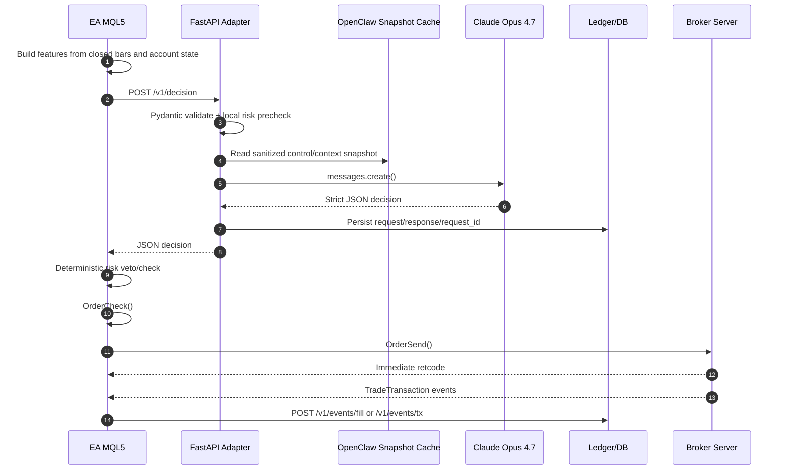
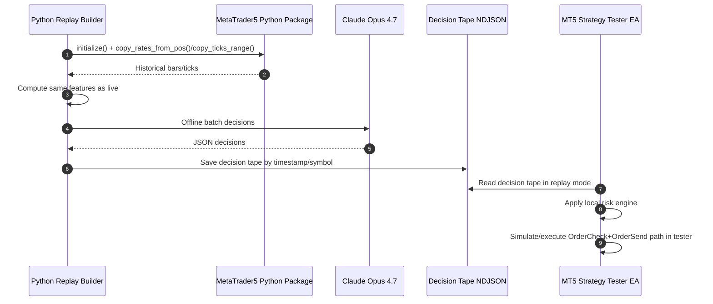

# Rancangan Teknis Bot Trading Claude Opus 4.7 di MetaTrader 5

## Ringkasan eksekutif

Rancangan teknis yang paling aman dan paling realistis untuk bot trading berbasis Claude Opus 4.7 di MetaTrader 5 adalah memisahkan **policy/decision layer** dari **execution layer**. Dalam rancangan ini, **EA/MQL5 tetap menjadi satu-satunya komponen yang boleh mengeksekusi order**, sementara **Python/FastAPI** menjadi adapter yang menerima snapshot fitur dari EA, memvalidasi payload, memanggil Claude, dan mengembalikan keputusan dalam JSON ketat. Arsitektur seperti ini sejalan dengan karakter MT5: `WebRequest()` hanya tersedia untuk Expert Advisors/scripts, bersifat synchronous, harus memakai daftar URL allowlist, dan **tidak bisa dijalankan di Strategy Tester**. Artinya, jalur live dan jalur backtest memang harus dipisahkan secara desain. citeturn35view4turn36view0turn35view0

Claude Opus 4.7 sendiri **memang tersedia secara resmi** sebagai model umum Anthropic pada 2026, dan merupakan model paling kapabel mereka untuk tugas kompleks. Namun migrasi ke Opus 4.7 membawa beberapa konsekuensi teknis penting: gunakan model ID `claude-opus-4-7`; **non-default sampling parameters** seperti `temperature`, `top_p`, dan `top_k` tidak boleh lagi diubah; **prefill assistant messages** tidak didukung; dan extended thinking lama berbasis `budget_tokens` sudah diganti oleh **adaptive thinking** dengan kontrol `effort`. Untuk hot path trading, ini berarti lebih aman memakai **Structured Outputs** atau prompt JSON ketat + validasi Pydantic, lalu memperlakukan setiap error/timeout sebagai **HOLD/NOOP**. citeturn37view0turn37view2turn10search0turn29view0

OpenClaw paling masuk akal diposisikan sebagai **controller/information orchestrator di luar hot path**, bukan sebagai eksekutor trading inline. Dokumentasi resmi OpenClaw menjelaskan bahwa Gateway-nya adalah control plane WebSocket yang memakai role/scope saat handshake, memiliki allowlist skill per-agent, tool policy, dan sandbox; tetapi dokumentasi security-nya juga menegaskan bahwa OpenClaw **bukan hostile multi-tenant boundary** dan diasumsikan berjalan dalam satu trust boundary operator. Karena itu, untuk bot trading, OpenClaw sebaiknya dipakai untuk mengelola **policy state yang lambat berubah** seperti mode risk, blackout window, operator kill-switch, kalender, atau skill query tertentu, lalu hasilnya di-cache dan dikonsumsi adapter Python secara read-only. citeturn38view0turn39view1turn39view2turn38view1turn38view2turn39view0

Secara praktis, rancangan ini paling cocok untuk **bar-close decisioning** pada M15/H1/H4, bukan scalping sub-second. Alasannya bukan hanya soal model latency, tetapi juga karena `WebRequest()` di EA memblokir thread eksekusi saat menunggu respons, dan event trade reconciliation di MT5 datang sebagai rantai transaksi yang urutannya tidak dijamin. Untuk menjaga determinisme, semua keputusan trading harus melewati **risk engine deterministik di EA**, lalu hasil fill dan perubahan posisi direkonsiliasi lewat `OnTradeTransaction()` yang cepat dan non-blocking. Dokumentasi MQL5 menekankan bahwa `OrderSend()` yang mengembalikan `true` **belum berarti order benar-benar tereksekusi**, dan `OnTradeTransaction()` bisa menerima beberapa event untuk satu request dengan antrian 1024 elemen. citeturn35view4turn35view0turn39view3turn40view0

## Validasi asumsi platform dan konsekuensi desain

### Asumsi model Claude dan implikasi pada hot path

Anthropic saat ini mendokumentasikan Claude Opus 4.7 sebagai model yang paling kapabel untuk tugas kompleks dan agentic coding, dengan dukungan konteks panjang, prompt caching, Files API, vision, dan tool ecosystem yang luas. Namun dokumentasi migrasi mereka juga menegaskan perubahan API yang sangat relevan untuk bot trading: Opus 4.7 meminta penggunaan `thinking: {type: "adaptive"}` jika thinking diaktifkan; `temperature/top_p/top_k` non-default akan error; dan assistant prefill tidak lagi boleh dipakai. Untuk integrasi policy layer trading, konsekuensi praktisnya adalah **jangan membangun jalur keputusan yang bergantung pada parameter sampling atau prefill**. Rancang prompt yang eksplisit, deterministic, dan gunakan structured output/strict schema sebagai kontrak antarmuka. citeturn37view0turn37view2turn31view1turn29view0

Anthropic juga menyarankan Structured Outputs bila Anda membutuhkan JSON yang selalu conform terhadap schema. Untuk integrasi EA ↔ Python, itu sangat cocok, karena layer eksekusi MQL5 tidak boleh menafsirkan teks bebas. Jika structured outputs belum dipakai pada tahap awal implementasi, fallback minimal yang masih aman adalah **JSON-only prompting + Pydantic validation + fail-closed policy**. Selain itu, `stop_reason` harus diperiksa: `end_turn` berarti jawaban selesai, sedangkan `max_tokens` berarti output terpotong dan tidak boleh dieksekusi, dan `tool_use` berarti model meminta loop tool tambahan. Untuk hot path trading, jalur paling aman adalah **menghindari tool loop sama sekali** di request keputusan order. citeturn10search0turn31view0turn11search5turn34search0

### Batasan MetaTrader 5 yang mengubah desain

Di sisi MT5, dokumentasi MQL5 menyebut bahwa semua built-in technical indicators mengembalikan **handle** yang sebaiknya dibuat di `OnInit()`, lalu data feature diambil dengan `CopyBuffer()`. Dokumentasi timeseries MQL5 juga mengingatkan bahwa index `0` mewakili **bar saat ini yang belum selesai**, sehingga untuk feature yang masuk ke model, pendekatan paling stabil adalah menggunakan **bar tertutup** (`shift=1`) agar tidak terjadi drift antara live dan replay. citeturn13search0turn12search10turn12search1turn12search4

Pembatas paling penting adalah `WebRequest()`: fungsi ini synchronous, hanya bisa dipakai di EA/scripts, membutuhkan daftar URL yang di-whitelist di terminal, dan **tidak dapat dieksekusi di Strategy Tester**. Ini bukan detail kecil; ini menentukan keseluruhan strategi backtest. Karena itu, rancangan yang sehat harus memisahkan **live HTTP mode** dari **replay/backtest mode**. Replay dilakukan lewat tape keputusan yang diproduksi Python sebelumnya, lalu dibaca EA dari file saat tester berjalan. citeturn35view4

### Posisi Python dan paket MetaTrader5 Python

Paket resmi `MetaTrader5` untuk Python memang mendukung koneksi terminal (`initialize`), pembacaan bars/ticks (`copy_rates_from_pos`, `copy_ticks_range`), pemeriksaan order (`order_check`), dan pengiriman order (`order_send`). Tetapi untuk sistem live yang juga memiliki EA MT5 aktif, keputusan arsitektural terbaik adalah **tidak membiarkan Python menjadi aktuator order kedua**. Gunakan Python/MetaTrader5 package untuk **riset, replay, pipeline data, validasi, dan monitoring**, sementara live trading tetap satu aktuator di EA. Ini menghindari split-brain execution dan menyederhanakan rekonsiliasi. citeturn26search4turn26search3turn12search3turn26search8turn26search2

## Arsitektur referensi dan alur eksekusi

### Komponen utama

Arsitektur referensi yang saya rekomendasikan terdiri dari enam komponen.

Pertama, **EA MQL5** bertugas mengumpulkan harga, posisi, spread, status akun, dan indicator buffers; membangun payload keputusan; memanggil adapter Python via `WebRequest()`; memeriksa respons; menjalankan `OrderCheck()` dan `OrderSend()`; lalu merekonsiliasi lifecycle order/fill di `OnTradeTransaction()`. Dokumentasi MQL5 memang merekomendasikan `OrderCheck()` sebelum `OrderSend()`, dan menekankan bahwa hasil `OrderSend()` harus dianalisis lewat `retcode` serta event lanjutan di handler trade. citeturn36view0turn35view0turn39view3

Kedua, **FastAPI adapter** menerima snapshot dari EA, memvalidasinya dengan Pydantic, menambahkan state internal seperti risk mode, ledger context, cooldown, atau OpenClaw state snapshot, lalu memanggil Claude. FastAPI secara resmi memang berbasis request body yang dideklarasikan melalui Pydantic model, dan response model juga bisa dipakai untuk validasi output server sebelum dikirim ke klien. Pydantic strict mode membantu menghindari coercion yang berbahaya pada field numerik trading. citeturn5search0turn5search7turn5search1

Ketiga, **Anthropic Claude API** dipakai murni sebagai decision/policy layer. Untuk jalur ini, gunakan request pendek, schema ketat, token budget terkendali, dan response fail-closed. Error handling harus mematuhi HTTP/API errors Anthropic: 429 rate limit, 529 overloaded, 504 timeout, 400 invalid request, dan semua error disertai `request_id` yang perlu dicatat untuk audit. Rate limiting Anthropic sendiri mengikuti token bucket dan mengembalikan `retry-after` serta header rate-limit. citeturn29view0turn30view0turn27search0

Keempat, **storage**. Untuk PoC satu mesin, SQLite cukup untuk ledger keputusan/order/fill. Untuk sistem operasional, lebih baik PostgreSQL sebagai source of truth, Redis untuk cache cepat dan rate-limit local bucket, serta object storage atau folder append-only untuk replay tapes. Ini adalah rekomendasi desain; basis resminya adalah bahwa Anda memang perlu melacak request/response IDs Anthropic, trade retcodes, dan urutan trade transaction secara auditabel. citeturn29view0turn35view3turn39view3

Kelima, **OpenClaw controller layer**. OpenClaw memiliki gateway WebSocket, role/scope handshake, skill visibility per-agent, tool policy, dan sandboxing. Dalam sistem trading, letakkan OpenClaw di sisi **control plane**: operator dapat mengubah `risk_mode`, pause trading, atau mengisi calendar snapshot. Hasilnya disimpan ke storage/cache lalu dibaca adapter Python. Jangan jadikan OpenClaw sebagai alat yang langsung memanggil EA atau mengirim order. citeturn38view0turn39view1turn39view2turn38view1turn38view2

Keenam, **observability stack**: logs terstruktur, metrics latency, parse failures, risk vetoes, drawdown, dan error rates. Anthropic SDK resmi memang menyediakan retries/error handling, tetapi tanggung jawab observability tetap ada di aplikasi sendiri. citeturn27search0turn27search7

### Diagram alur live



Desain live di atas sengaja menaruh **risk veto final di EA**, bukan di Python. Ini wajib, karena hanya EA yang memiliki status broker paling dekat, termasuk spread aktual, stop/freeze levels, dan retcode server sesaat sebelum order dikirim. `OrderCheck()` memberi margin, free margin, comment, dan retcode check; sedangkan `OrderSend()` yang sukses secara sintaks tetap belum menjamin execution final. citeturn36view0turn35view0turn39view3

### Diagram alur backtest dan replay



Karena `WebRequest()` tidak dapat dijalankan di Strategy Tester, **replay tape** adalah pola yang paling robust untuk menjaga parity antara live dan backtest. Python dapat mengambil historical bars/ticks dari paket resmi MetaTrader5, menghitung feature set yang sama dengan live, memanggil Claude secara offline, lalu menulis keputusan ke tape yang diputar ulang di tester. Dokumentasi Python integration resmi MT5 mendukung semua komponen data yang dibutuhkan untuk replay seperti `copy_rates_from_pos`, `copy_rates_range`, dan `copy_ticks_range`. citeturn35view4turn26search3turn12search15turn12search3

### Topologi jaringan yang direkomendasikan

Untuk deployment praktis, gunakan jaringan berikut.

EA berjalan di host/VM yang sama dengan terminal MT5. FastAPI adapter bisa berada di host yang sama atau di node LAN yang dekat, tetapi paling aman jika **hanya diekspos ke jaringan privat**. Komunikasi EA → adapter dilakukan via HTTPS internal plus header HMAC. Anthropic API diakses hanya dari adapter. OpenClaw Gateway berada di jaringan privat yang sama, diakses oleh adapter atau operator UI, bukan oleh EA secara langsung. Dalam model ini, **satu-satunya jalur yang boleh menyentuh broker adalah EA**.

OpenClaw sendiri mendeskripsikan gateway WS sebagai single control plane, dan dokumen security-nya menekankan satu trust boundary per gateway. Itu cocok untuk mode operator tunggal, tetapi berarti Anda **tidak boleh** mengekspos gateway yang sama ke pengguna eksternal yang tidak saling percaya. citeturn38view0turn39view0

## Desain fitur dan indikator teknikal

### Prinsip feature engineering

Untuk LLM policy layer, indikator tidak boleh dikirim sebagai “angka mentah” saja. Setiap indikator sebaiknya diturunkan menjadi **fitur numerik yang sudah dinormalisasi** agar prompt tetap ringkas dan konsisten lintas simbol/timeframe.

Desain yang saya rekomendasikan:

- gunakan **bar tertutup** (`shift=1`) sebagai basis semua fitur;
- kirim **nilai saat ini**, **delta satu bar**, **slope pendek**, dan **status rezim**;
- ubah indikator bounded seperti RSI/Stochastic menjadi nilai terpusat di sekitar nol;
- ubah indikator berbasis level harga menjadi **distance normalized by ATR** atau by rolling standard deviation;
- tambahkan **z-score rolling** dan **percentile rolling** untuk memberi konteks historis lokal pada model.

Rumus transformasi yang praktis:

```text
rsi_centered = (RSI - 50.0) / 50.0                # range kira-kira [-1, +1]
stoch_centered = (StochK - 50.0) / 50.0
adx_strength = ADX / 100.0
di_balance = (DIplus - DIminus) / (DIplus + DIminus + 1e-9)

atr_pct = ATR / Close
bb_width = (UpperBand - LowerBand) / MiddleBand
bb_pos = (Close - MiddleBand) / max((UpperBand - LowerBand)/2, eps)

ma_gap_atr = (MA_fast - MA_slow) / ATR
price_vs_ma_atr = (Close - MA_fast) / ATR
macd_atr = MACD_main / ATR
macd_signal_gap_atr = (MACD_main - MACD_signal) / ATR

cci_scaled = clip(CCI / 200.0, -3.0, 3.0)
mom_log = log(max(Momentum, eps))
vol_log_z = zscore(log(1 + Volume), lookback=252)
obv_delta_z = zscore(OBV[t] - OBV[t-1], lookback=252)

feature_z = (x - rolling_mean(x, N)) / rolling_std(x, N)
feature_pct = empirical_percentile(x, lookback=N)
```

Lookback default yang layak untuk z-score dan percentile adalah **252 bar** untuk context umum, lalu 63 atau 126 bila ingin adaptasi lebih cepat. Ini adalah pilihan desain, bukan batas MQL5. Untuk pasangan fitur/timeframe, baseline yang paling stabil biasanya **H4 context + H1 decision + M15 trigger**, atau **H1 context + M15 decision + M5 execution-check**, tetapi keputusan model tetap saya sarankan dilakukan **pada penutupan bar**, bukan tiap tick, karena `WebRequest()` synchronous dan jalur LLM memang bukan low-latency execution engine. citeturn12search4turn35view4

### Tabel indikator trend dan structure

> Catatan: kolom “default demo” di bawah mengacu pada **nilai input contoh resmi MetaQuotes** di halaman dokumentasi indikator, bukan default bahasa MQL5 yang dipaksakan compiler.

| Kategori | Fungsi MQL5 | Parameter inti | Default demo resmi | Buffer penting | Pemakaian fitur yang direkomendasikan | Sumber |
|---|---|---|---|---|---|---|
| Moving Average | `iMA(symbol, period, ma_period, ma_shift, ma_method, applied_price)` | `ma_period`, `ma_shift`, `ma_method`, `applied_price` | `10, 0, MODE_SMA, PRICE_CLOSE` | 0 = MA | `price_vs_ma_atr`, `ma_slope`, `fast_slow_gap_atr` | citeturn18search3turn25view0 |
| ADX | `iADX(symbol, period, adx_period)` | `adx_period` | `14` | 0=ADX, 1=+DI, 2=-DI | `adx_strength`, `di_balance`, trend-regime flag | citeturn24view0 |
| MACD | `iMACD(symbol, period, fast_ema_period, slow_ema_period, signal_period, applied_price)` | `fast`, `slow`, `signal`, `applied_price` | `12, 26, 9, PRICE_CLOSE` | 0=MAIN, 1=SIGNAL | `macd_atr`, `macd_signal_gap_atr`, cross-state | citeturn22view2turn23view0 |
| Ichimoku | `iIchimoku(symbol, period, tenkan_sen, kijun_sen, senkou_span_b)` | `tenkan`, `kijun`, `span_b` | `9, 26, 52` | 0=Tenkan,1=Kijun,2=SpanA,3=SpanB,4=Chikou | `close_vs_cloud_atr`, `tenkan_kijun_gap_atr`, cloud-thickness/ATR | citeturn22view0turn23view2 |
| Fractals | `iFractals(symbol, period)` | tidak ada window input | N/A | 0=upper, 1=lower | `dist_to_last_fractal_up_atr`, `dist_to_last_fractal_down_atr`, swing-structure flag | citeturn15search3turn25view6 |

Untuk trend family, transform terbaik biasanya bukan nilai mentah, tetapi **jarak antar level yang dinormalisasi ATR** dan **slope beberapa bar**. ADX sangat berguna untuk memisahkan market trending vs non-trending, sementara `+DI/-DI` memberi arah trend. Ichimoku bagus sebagai kumpulan fitur struktur, bukan hanya sinyal “cloud breakout”. Semua built-in indicators ini menggunakan handle, dan nilai buffer diambil dengan `CopyBuffer()`. citeturn24view0turn22view0turn13search0turn12search1

### Tabel indikator momentum dan oscillator

| Kategori | Fungsi MQL5 | Parameter inti | Default demo resmi | Buffer penting | Pemakaian fitur yang direkomendasikan | Sumber |
|---|---|---|---|---|---|---|
| RSI | `iRSI(symbol, period, ma_period, applied_price)` | `ma_period`, `applied_price` | `14, PRICE_CLOSE` | 0=RSI | `rsi_centered`, `rsi_z`, overbought/oversold percentile | citeturn22view1turn23view1 |
| Stochastic | `iStochastic(symbol, period, Kperiod, Dperiod, slowing, ma_method, price_field)` | `%K`, `%D`, `slowing`, `ma_method`, `price_field` | `5, 3, 3, MODE_SMA, STO_LOWHIGH` | 0=MAIN,1=SIGNAL | `stoch_centered`, `k_d_gap`, reversal-candidate flag | citeturn18search1turn25view2 |
| CCI | `iCCI(symbol, period, ma_period, applied_price)` | `ma_period`, `applied_price` | `14, PRICE_TYPICAL` | 0=CCI | `cci_scaled`, `cci_z`, mean-reversion pressure | citeturn15search0turn25view3 |
| Momentum | `iMomentum(symbol, period, mom_period, applied_price)` | `mom_period`, `applied_price` | `14, PRICE_CLOSE` | 0=Momentum | `mom_log`, `mom_delta`, momentum percentile | citeturn18search2turn25view7 |

RSI dan Stochastic adalah indikator bounded, sehingga transform terbaik biasanya **centering** ke nol dan menambahkan z-score/percentile lokal. CCI dan Momentum lebih cocok di-scale atau di-log lalu di-z-score. Jangan kirim “RSI=71” saja; kirim pula konteks historisnya, misalnya “RSI sekarang 71, percentile 93%, naik 4 bar berturut-turut”. Ini membuat policy layer jauh lebih stabil. Rentang 0–100 untuk RSI serta level contoh 70/30 didokumentasikan pada halaman RSI MQL5, dan level contoh ±100 juga muncul di dokumentasi demo CCI. citeturn22view1turn15search0

### Tabel indikator volatilitas dan volume

| Kategori | Fungsi MQL5 | Parameter inti | Default demo resmi | Buffer penting | Pemakaian fitur yang direkomendasikan | Sumber |
|---|---|---|---|---|---|---|
| ATR | `iATR(symbol, period, ma_period)` | `ma_period` | `14` | 0=ATR | `atr_pct`, regime volatility, stop-distance base | citeturn14search1turn25view1 |
| Bollinger Bands | `iBands(symbol, period, bands_period, bands_shift, deviation, applied_price)` | `period`, `shift`, `deviation`, `applied_price` | `20, 0, 2.0, PRICE_CLOSE` | 0=BASE,1=UPPER,2=LOWER | `bb_width`, `bb_pos`, squeeze/expansion percentile | citeturn21view0turn23view3 |
| StdDev | `iStdDev(symbol, period, ma_period, ma_shift, ma_method, applied_price)` | `period`, `shift`, `ma_method`, `applied_price` | `20, 0, MODE_SMA, PRICE_CLOSE` | 0=StdDev | rolling-vol proxy, `stddev_pct`, normalize MACD/returns | citeturn19search0turn25view8 |
| Volumes | `iVolumes(symbol, period, applied_volume)` | `applied_volume` | `VOLUME_TICK` | 0=volume buffer utama | `vol_log_z`, volume spike percentile | citeturn15search1turn25view5 |
| OBV | `iOBV(symbol, period, applied_volume)` | `applied_volume` | `VOLUME_TICK` | 0=OBV | `obv_delta_z`, divergence with price slope | citeturn17search0turn25view9 |
| MFI | `iMFI(symbol, period, ma_period, applied_volume)` | `ma_period`, `applied_volume` | `14, VOLUME_TICK` | 0=MFI | `mfi_centered`, money-flow regime, reversal filter | citeturn15search2turn25view4 |

ATR adalah indikator paling penting untuk **risk sizing** dan normalisasi jarak antar level. Bollinger dan StdDev menangkap compression/expansion. Volume, OBV, dan MFI sangat berguna untuk memberi model konteks apakah breakout/reversal didukung oleh partisipasi pasar. Di MT5 Python integration, bars dan ticks yang diambil untuk riset mencakup kolom `tick_volume`, `spread`, dan `real_volume` bila tersedia, sehingga pipeline replay bisa tetap selaras dengan fitur volume live EA. citeturn26search3turn12search3

### Matrix transform fitur per timeframe

| Timeframe role | Tujuan | Fitur utama | Transform yang disarankan |
|---|---|---|---|
| Context TF | Menentukan rezim pasar | ADX, MA slope, cloud position, ATR percentile | raw + z-score 252 + percentile 252 |
| Decision TF | Menentukan bias entry/exit | RSI/Stoch/CCI/MACD/BBands | centered values + delta 1–3 bar + percentile |
| Execution TF | Menentukan kualitas entry | spread, ATR micro, candle body/range, distance to SL/TP | ATR-normalized distances + freshness checks |
| Risk TF | Menentukan sizing dan blackout | ATR, drawdown, free margin, open risk | deterministic thresholds, bukan LLM-only |

Jika simbol/timeframe belum ditentukan, baseline yang paling realistis untuk memulai adalah **H4 sebagai context, H1 sebagai decision, M15 untuk execution filters**, dengan cadence model pada **bar close H1 atau M15**, dan M5/tick hanya dipakai untuk spread/freshness/risk checks di EA. Ini adalah rekomendasi desain yang mengikuti sifat synchronous `WebRequest()` dan pola fail-closed execution. citeturn35view4

## Kontrak API antara EA dan Python

### Prinsip kontrak

Kontrak API harus dirancang agar **EA hanya mengirim fakta**, bukan keputusan, dan **Python hanya mengembalikan JSON yang bisa dieksekusi atau ditolak secara deterministik**. Saya sarankan **tidak ada push callback Python → EA**. MQL5 pada praktiknya bertindak sebagai HTTP client via `WebRequest()`, jadi kontrak Python → EA cukup berupa **synchronous HTTP response**. Untuk event asinkron seperti fill reconciliation, EA cukup melakukan POST balik ke adapter setelah `OnTradeTransaction()`. citeturn35view4turn39view3

### Endpoint yang direkomendasikan

| Method | Endpoint | Arah | Fungsi |
|---|---|---|---|
| `POST` | `/v1/decision` | EA → Python → EA | Permintaan keputusan trading sinkron |
| `POST` | `/v1/events/trade-transaction` | EA → Python | Rekonsiliasi order/deal/position |
| `POST` | `/v1/events/heartbeat` | EA → Python | Health, spread, connectivity, mode |
| `GET` | `/v1/healthz` | EA/ops → Python | Liveness/readiness |
| `POST` | `/v1/replay/build` | Ops/Python internal | Build decision tape dari history |
| `POST` | `/v1/replay/query` | EA replay mode → Python optional | Hanya untuk outside tester, bukan tester asli |

### JSON schema permintaan keputusan

Di bawah ini adalah schema desain yang saya rekomendasikan. Ini bukan schema resmi Anthropic ataupun MQL5; ini adalah kontrak antarmuka sistem Anda.

```json
{
  "type": "object",
  "required": [
    "schema_version",
    "request_id",
    "mode",
    "timestamp_utc",
    "symbol",
    "timeframe",
    "bar_index",
    "market",
    "account",
    "position",
    "risk_state",
    "features"
  ],
  "properties": {
    "schema_version": { "type": "string", "const": "trade-decision-request.v1" },
    "request_id": { "type": "string" },
    "mode": { "type": "string", "enum": ["live", "paper", "replay"] },
    "timestamp_utc": { "type": "string", "format": "date-time" },
    "symbol": { "type": "string" },
    "timeframe": { "type": "string" },
    "bar_index": { "type": "integer" },
    "market": {
      "type": "object",
      "required": ["bid", "ask", "last_close", "spread_points", "digits"],
      "properties": {
        "bid": { "type": "number" },
        "ask": { "type": "number" },
        "last_close": { "type": "number" },
        "spread_points": { "type": "number" },
        "digits": { "type": "integer" },
        "stops_level_points": { "type": "integer" },
        "freeze_level_points": { "type": "integer" },
        "tick_size": { "type": "number" },
        "tick_value": { "type": "number" }
      }
    },
    "account": {
      "type": "object",
      "required": ["balance", "equity", "free_margin", "margin_level"],
      "properties": {
        "login": { "type": "string" },
        "balance": { "type": "number" },
        "equity": { "type": "number" },
        "free_margin": { "type": "number" },
        "margin_level": { "type": "number" },
        "currency": { "type": "string" },
        "leverage": { "type": "integer" }
      }
    },
    "position": {
      "type": "object",
      "required": ["net_position", "open_positions_count", "pending_orders_count"],
      "properties": {
        "net_position": { "type": "number" },
        "avg_price": { "type": "number" },
        "floating_pnl": { "type": "number" },
        "open_positions_count": { "type": "integer" },
        "pending_orders_count": { "type": "integer" },
        "side": { "type": "string", "enum": ["flat", "long", "short"] }
      }
    },
    "risk_state": {
      "type": "object",
      "required": [
        "max_risk_per_trade_pct",
        "max_symbol_exposure_lots",
        "daily_drawdown_pct",
        "trading_halted"
      ],
      "properties": {
        "max_risk_per_trade_pct": { "type": "number" },
        "max_symbol_exposure_lots": { "type": "number" },
        "daily_drawdown_pct": { "type": "number" },
        "consecutive_losses": { "type": "integer" },
        "cooldown_until_utc": { "type": ["string", "null"] },
        "trading_halted": { "type": "boolean" },
        "blackout_reason": { "type": ["string", "null"] }
      }
    },
    "features": {
      "type": "object",
      "required": ["context_tf", "decision_tf", "execution_tf"],
      "properties": {
        "context_tf": { "type": "object" },
        "decision_tf": { "type": "object" },
        "execution_tf": { "type": "object" }
      }
    },
    "openclaw_context": {
      "type": "object",
      "properties": {
        "mode": { "type": "string", "enum": ["normal", "reduce-risk", "halt"] },
        "operator_notes": { "type": "string" },
        "calendar_flags": { "type": "array", "items": { "type": "string" } }
      }
    }
  }
}
```

### Contoh payload EA → Python

```json
{
  "schema_version": "trade-decision-request.v1",
  "request_id": "EURUSD-H1-2026-05-15T09:00:00Z-184220",
  "mode": "live",
  "timestamp_utc": "2026-05-15T09:00:00Z",
  "symbol": "EURUSD",
  "timeframe": "H1",
  "bar_index": 184220,
  "market": {
    "bid": 1.08421,
    "ask": 1.08429,
    "last_close": 1.08410,
    "spread_points": 8,
    "digits": 5,
    "stops_level_points": 20,
    "freeze_level_points": 10,
    "tick_size": 0.00001,
    "tick_value": 1.0
  },
  "account": {
    "login": "masked-25115284",
    "balance": 10000.0,
    "equity": 10034.7,
    "free_margin": 9410.5,
    "margin_level": 875.4,
    "currency": "USD",
    "leverage": 100
  },
  "position": {
    "net_position": 0.0,
    "avg_price": 0.0,
    "floating_pnl": 0.0,
    "open_positions_count": 0,
    "pending_orders_count": 0,
    "side": "flat"
  },
  "risk_state": {
    "max_risk_per_trade_pct": 0.5,
    "max_symbol_exposure_lots": 0.30,
    "daily_drawdown_pct": 0.7,
    "consecutive_losses": 1,
    "cooldown_until_utc": null,
    "trading_halted": false,
    "blackout_reason": null
  },
  "features": {
    "context_tf": {
      "adx_14": 24.1,
      "adx_strength": 0.241,
      "di_balance": 0.18,
      "ma_gap_atr": 0.53,
      "atr_pct": 0.0039,
      "atr_pct_pct_252": 0.61
    },
    "decision_tf": {
      "rsi_14": 57.4,
      "rsi_centered": 0.148,
      "macd_main": 0.00042,
      "macd_signal_gap_atr": 0.11,
      "bb_width": 0.0072,
      "bb_pos": 0.31,
      "cci_scaled": 0.44
    },
    "execution_tf": {
      "spread_to_atr_ratio": 0.08,
      "price_vs_ma_fast_atr": 0.17,
      "last_bar_body_atr": 0.32
    }
  },
  "openclaw_context": {
    "mode": "normal",
    "operator_notes": "",
    "calendar_flags": []
  }
}
```

### JSON schema respons Python → EA

Respons sebaiknya dibuat **cukup datar** untuk memudahkan parsing di MQL5.

```json
{
  "type": "object",
  "required": [
    "schema_version",
    "request_id",
    "status",
    "decision"
  ],
  "properties": {
    "schema_version": { "type": "string", "const": "trade-decision-response.v1" },
    "request_id": { "type": "string" },
    "status": { "type": "string", "enum": ["ok", "degraded", "error"] },
    "decision": {
      "type": "object",
      "required": [
        "action",
        "side",
        "order_type",
        "lots",
        "sl",
        "tp",
        "max_deviation_points",
        "valid_until_utc",
        "confidence",
        "rationale_short",
        "reason_codes"
      ],
      "properties": {
        "action": { "type": "string", "enum": ["hold", "open", "close", "reduce", "reverse", "modify"] },
        "side": { "type": "string", "enum": ["flat", "buy", "sell"] },
        "order_type": { "type": "string", "enum": ["none", "market", "limit", "stop"] },
        "lots": { "type": "number" },
        "entry_price": { "type": ["number", "null"] },
        "sl": { "type": ["number", "null"] },
        "tp": { "type": ["number", "null"] },
        "max_deviation_points": { "type": "integer" },
        "valid_until_utc": { "type": "string", "format": "date-time" },
        "confidence": { "type": "number" },
        "rationale_short": { "type": "string", "maxLength": 240 },
        "reason_codes": { "type": "array", "items": { "type": "string" } },
        "risk_note": { "type": "string" }
      }
    },
    "meta": {
      "type": "object",
      "properties": {
        "model": { "type": "string" },
        "anthropic_request_id": { "type": "string" },
        "input_tokens": { "type": "integer" },
        "output_tokens": { "type": "integer" },
        "latency_ms": { "type": "integer" }
      }
    },
    "error": {
      "type": ["object", "null"],
      "properties": {
        "code": { "type": "string" },
        "message": { "type": "string" },
        "retryable": { "type": "boolean" }
      }
    }
  }
}
```

### Contoh respons Python → EA

```json
{
  "schema_version": "trade-decision-response.v1",
  "request_id": "EURUSD-H1-2026-05-15T09:00:00Z-184220",
  "status": "ok",
  "decision": {
    "action": "open",
    "side": "buy",
    "order_type": "market",
    "lots": 0.12,
    "entry_price": null,
    "sl": 1.08295,
    "tp": 1.08680,
    "max_deviation_points": 12,
    "valid_until_utc": "2026-05-15T09:02:00Z",
    "confidence": 0.73,
    "rationale_short": "Trend H4 moderat naik, H1 momentum positif, spread masih wajar, risk budget tersedia.",
    "reason_codes": ["TREND_OK", "MOMENTUM_OK", "SPREAD_OK", "RISK_OK"],
    "risk_note": "Invalidate if spread_points > 15 before send."
  },
  "meta": {
    "model": "claude-opus-4-7",
    "anthropic_request_id": "req_018EeWyXxfu5pfWkrYcMdjWG",
    "input_tokens": 1452,
    "output_tokens": 146,
    "latency_ms": 812
  },
  "error": null
}
```

### Error codes, timeout, dan retry logic

Anthropic secara resmi mengembalikan tipe error yang jelas seperti `invalid_request_error` (400), `rate_limit_error` (429), `timeout_error` (504), dan `overloaded_error` (529), serta `request_id` untuk tracing. Rate limit juga mengembalikan `retry-after`. Di sisi aplikasi, saya sarankan error internal dipetakan ke kode yang lebih operasional. citeturn29view0turn30view0

| Lapisan | Kode | HTTP | Retry | Makna |
|---|---|---:|---|---|
| Adapter | `APP-VAL-400` | 400 | Tidak | Payload request invalid |
| Adapter | `APP-AUTH-401` | 401 | Tidak | API key/HMAC invalid |
| Adapter | `APP-RL-429` | 429 | Ya, patuhi `retry-after` | Local rate limit / Anthropic 429 |
| Adapter | `APP-UPSTR-529` | 503 | Ya, bounded | Anthropic overloaded |
| Adapter | `APP-UPSTR-504` | 504 | Ya, bounded | Anthropic timeout |
| Adapter | `APP-DEC-422` | 422 | Tidak | Output model tidak valid terhadap schema |
| Adapter | `APP-SAFE-409` | 409 | Tidak | OpenClaw/control state memblokir |
| EA local | `EA_PARSE_FAIL` | n/a | Tidak | Response JSON tak bisa diparse |
| EA local | `EA_RISK_BLOCK` | n/a | Tidak | Risk engine veto |
| EA local | `EA_ORDERCHECK_FAIL` | n/a | Tidak | `OrderCheck()` gagal |
| EA local | `EA_ORDERSEND_RETCODE_*` | n/a | Tergantung | Trade server retcode |

**Timeout dan retry yang direkomendasikan**

- `EA -> Adapter timeout`: **2000 ms** default untuk intraday; di atas itu, return gagal dan EA harus **HOLD**.
- `Adapter -> Anthropic deadline`: **lebih kecil dari timeout EA**, misalnya 1500–1700 ms, agar masih ada waktu serialisasi respons.
- **Satu kali retry saja** untuk 429/529/network transient, dan hanya jika total budget waktu masih cukup.
- **Jangan retry** order placement ambigu di EA tanpa idempotency logic dan rekonsiliasi transaction.
- Jika adapter menerima error Anthropic atau JSON model invalid, balas `status="degraded"` dengan `decision.action="hold"`.

Karena Anthropic SDK resmi mendukung retries dan error handling bawaan, Anda dapat memanfaatkan itu sebagai lapisan dasar, tetapi tetap perlu **deadline aplikasi sendiri** agar thread EA tidak menunggu terlalu lama. citeturn27search0turn27search7turn29view0turn30view0

## Implementasi referensi Python dan EA MQL5

### Adapter FastAPI berbasis Python

Pada implementasi Python, saya sarankan pola berikut:

- **FastAPI + Pydantic v2** untuk request/response validation;
- **SQLite atau Postgres ledger** untuk request, response, fill, dan replay tape;
- **Anthropic client** hanya di adapter;
- **strict schema** pada keputusan;
- **prompt singkat dan eksplisit**;
- **replay mode** yang bisa menulis tape keputusan untuk tester;
- **fail closed** pada semua exception.

FastAPI dan Pydantic memang secara resmi dirancang untuk request body validation dan response filtering. Strict mode Pydantic membantu menjaga field seperti `lots`, `sl`, `tp`, `spread_points`, dan `margin_level` tetap bertipe yang diharapkan. citeturn5search0turn5search7turn5search1turn5search19

#### Contoh kode FastAPI adapter

```python
from __future__ import annotations

import json
import sqlite3
import time
import uuid
from contextlib import asynccontextmanager
from datetime import datetime, timezone
from pathlib import Path
from typing import Any, Literal, Optional

from fastapi import FastAPI, Header, HTTPException, Request
from fastapi.responses import JSONResponse
from pydantic import BaseModel, ConfigDict, Field, ValidationError
from pydantic_settings import BaseSettings, SettingsConfigDict

# Official SDKs provide retries/error handling; keep app-level deadlines too.
from anthropic import Anthropic

APP_VERSION = "0.1.0"


class Settings(BaseSettings):
    model_config = SettingsConfigDict(env_file=".env", extra="ignore")

    anthropic_api_key: str
    anthropic_model: str = "claude-opus-4-7"
    anthropic_timeout_seconds: float = 1.6

    internal_hmac_key: str = "change-me"
    db_path: str = "./trade_ledger.db"
    replay_dir: str = "./replay_tapes"

    adapter_default_max_deviation_points: int = 12


settings = Settings()


class MarketSnapshot(BaseModel):
    model_config = ConfigDict(strict=True)

    bid: float
    ask: float
    last_close: float
    spread_points: float
    digits: int
    stops_level_points: int = 0
    freeze_level_points: int = 0
    tick_size: float = 0.0
    tick_value: float = 0.0


class AccountSnapshot(BaseModel):
    model_config = ConfigDict(strict=True)

    login: str
    balance: float
    equity: float
    free_margin: float
    margin_level: float
    currency: str = "USD"
    leverage: int = 0


class PositionSnapshot(BaseModel):
    model_config = ConfigDict(strict=True)

    net_position: float
    avg_price: float = 0.0
    floating_pnl: float = 0.0
    open_positions_count: int
    pending_orders_count: int
    side: Literal["flat", "long", "short"]


class RiskState(BaseModel):
    model_config = ConfigDict(strict=True)

    max_risk_per_trade_pct: float
    max_symbol_exposure_lots: float
    daily_drawdown_pct: float
    consecutive_losses: int = 0
    cooldown_until_utc: Optional[str] = None
    trading_halted: bool
    blackout_reason: Optional[str] = None


class FeatureBundle(BaseModel):
    model_config = ConfigDict(strict=True)

    context_tf: dict[str, float]
    decision_tf: dict[str, float]
    execution_tf: dict[str, float]


class OpenClawContext(BaseModel):
    model_config = ConfigDict(strict=True)

    mode: Literal["normal", "reduce-risk", "halt"] = "normal"
    operator_notes: str = ""
    calendar_flags: list[str] = Field(default_factory=list)


class DecisionRequest(BaseModel):
    model_config = ConfigDict(strict=True)

    schema_version: Literal["trade-decision-request.v1"]
    request_id: str
    mode: Literal["live", "paper", "replay"]
    timestamp_utc: str
    symbol: str
    timeframe: str
    bar_index: int
    market: MarketSnapshot
    account: AccountSnapshot
    position: PositionSnapshot
    risk_state: RiskState
    features: FeatureBundle
    openclaw_context: OpenClawContext = Field(default_factory=OpenClawContext)


class TradeDecision(BaseModel):
    model_config = ConfigDict(strict=True)

    action: Literal["hold", "open", "close", "reduce", "reverse", "modify"]
    side: Literal["flat", "buy", "sell"]
    order_type: Literal["none", "market", "limit", "stop"]
    lots: float
    entry_price: Optional[float] = None
    sl: Optional[float] = None
    tp: Optional[float] = None
    max_deviation_points: int
    valid_until_utc: str
    confidence: float = Field(ge=0.0, le=1.0)
    rationale_short: str = Field(max_length=240)
    reason_codes: list[str]
    risk_note: str = ""


class ResponseMeta(BaseModel):
    model_config = ConfigDict(strict=True)

    model: str
    anthropic_request_id: str = ""
    input_tokens: int = 0
    output_tokens: int = 0
    latency_ms: int = 0


class AdapterError(BaseModel):
    model_config = ConfigDict(strict=True)

    code: str
    message: str
    retryable: bool


class DecisionResponse(BaseModel):
    model_config = ConfigDict(strict=True)

    schema_version: Literal["trade-decision-response.v1"]
    request_id: str
    status: Literal["ok", "degraded", "error"]
    decision: TradeDecision
    meta: ResponseMeta
    error: Optional[AdapterError] = None


class TradeTransactionEvent(BaseModel):
    model_config = ConfigDict(strict=True)

    schema_version: Literal["trade-transaction-event.v1"]
    request_id: str
    symbol: str
    trans_type: str
    order: int = 0
    deal: int = 0
    position: int = 0
    retcode: int = 0
    comment: str = ""
    time_utc: str


class Ledger:
    def __init__(self, path: str) -> None:
        self.path = path
        self.conn = sqlite3.connect(path, check_same_thread=False)
        self.conn.execute("""
        CREATE TABLE IF NOT EXISTS decisions (
            request_id TEXT PRIMARY KEY,
            mode TEXT,
            symbol TEXT,
            timeframe TEXT,
            ts_utc TEXT,
            request_json TEXT,
            response_json TEXT,
            status TEXT,
            action TEXT,
            anthropic_request_id TEXT,
            latency_ms INTEGER,
            created_at TEXT
        )
        """)
        self.conn.execute("""
        CREATE TABLE IF NOT EXISTS trade_events (
            id TEXT PRIMARY KEY,
            request_id TEXT,
            symbol TEXT,
            trans_type TEXT,
            order_ticket INTEGER,
            deal_ticket INTEGER,
            position_ticket INTEGER,
            retcode INTEGER,
            payload_json TEXT,
            created_at TEXT
        )
        """)
        self.conn.commit()

    def write_decision(self, req: DecisionRequest, resp: DecisionResponse) -> None:
        self.conn.execute(
            """
            INSERT OR REPLACE INTO decisions
            (request_id, mode, symbol, timeframe, ts_utc, request_json, response_json,
             status, action, anthropic_request_id, latency_ms, created_at)
            VALUES (?, ?, ?, ?, ?, ?, ?, ?, ?, ?, ?, ?)
            """,
            (
                req.request_id,
                req.mode,
                req.symbol,
                req.timeframe,
                req.timestamp_utc,
                req.model_dump_json(),
                resp.model_dump_json(),
                resp.status,
                resp.decision.action,
                resp.meta.anthropic_request_id,
                resp.meta.latency_ms,
                now_utc(),
            ),
        )
        self.conn.commit()

    def write_trade_event(self, event: TradeTransactionEvent) -> None:
        self.conn.execute(
            """
            INSERT INTO trade_events
            (id, request_id, symbol, trans_type, order_ticket, deal_ticket, position_ticket,
             retcode, payload_json, created_at)
            VALUES (?, ?, ?, ?, ?, ?, ?, ?, ?, ?)
            """,
            (
                str(uuid.uuid4()),
                event.request_id,
                event.symbol,
                event.trans_type,
                event.order,
                event.deal,
                event.position,
                event.retcode,
                event.model_dump_json(),
                now_utc(),
            ),
        )
        self.conn.commit()


def now_utc() -> str:
    return datetime.now(timezone.utc).isoformat()


def hmac_ok(raw_body: bytes, signature: str | None) -> bool:
    # Simplified placeholder; use HMAC-SHA256 in production
    return signature == settings.internal_hmac_key


def fail_hold(
    request_id: str,
    code: str,
    message: str,
    retryable: bool,
    latency_ms: int = 0,
) -> DecisionResponse:
    return DecisionResponse(
        schema_version="trade-decision-response.v1",
        request_id=request_id,
        status="degraded",
        decision=TradeDecision(
            action="hold",
            side="flat",
            order_type="none",
            lots=0.0,
            entry_price=None,
            sl=None,
            tp=None,
            max_deviation_points=settings.adapter_default_max_deviation_points,
            valid_until_utc=now_utc(),
            confidence=0.0,
            rationale_short="Hold karena adapter/dependency error.",
            reason_codes=[code],
            risk_note=message,
        ),
        meta=ResponseMeta(
            model=settings.anthropic_model,
            anthropic_request_id="",
            input_tokens=0,
            output_tokens=0,
            latency_ms=latency_ms,
        ),
        error=AdapterError(code=code, message=message, retryable=retryable),
    )


def local_precheck(req: DecisionRequest) -> Optional[DecisionResponse]:
    if req.risk_state.trading_halted:
        return fail_hold(req.request_id, "APP-SAFE-409", "Trading halted by risk_state.", False)

    if req.openclaw_context.mode == "halt":
        return fail_hold(req.request_id, "APP-SAFE-409", "Trading halted by OpenClaw control state.", False)

    if req.market.spread_points <= 0:
        return fail_hold(req.request_id, "APP-VAL-400", "Invalid spread_points.", False)

    return None


SYSTEM_PROMPT = """\
You are the policy layer of an MT5 trading system.
You do NOT execute trades.
You MUST return exactly one decision object.
Use only the supplied structured market/account/risk/features.
If the data is stale, contradictory, incomplete, or risk is poor, choose HOLD.
Never exceed the supplied risk budget.
Prefer no trade over low-quality trade.
No prose outside the JSON object.
"""

DECISION_JSON_TEMPLATE = """\
Return a JSON object with these exact keys:
action, side, order_type, lots, entry_price, sl, tp, max_deviation_points,
valid_until_utc, confidence, rationale_short, reason_codes, risk_note

Rules:
- action in ["hold","open","close","reduce","reverse","modify"]
- side in ["flat","buy","sell"]
- order_type in ["none","market","limit","stop"]
- If action="hold", then lots=0, order_type="none", side="flat"
- Use realistic sl/tp numerical values when action opens/modifies a trade
- rationale_short max 240 chars
- reason_codes is an array of uppercase snake_case strings
"""


def build_user_prompt(req: DecisionRequest) -> str:
    compact = req.model_dump()
    return (
        DECISION_JSON_TEMPLATE
        + "\n\nINPUT_JSON:\n"
        + json.dumps(compact, separators=(",", ":"), ensure_ascii=False)
    )


def call_claude(req: DecisionRequest) -> tuple[TradeDecision, ResponseMeta]:
    """
    NOTE:
    For production, prefer Anthropic Structured Outputs (`output_config.format`)
    if your SDK/runtime version supports it consistently.
    This example keeps an additional strict Pydantic parser as a second defense.
    """
    start = time.perf_counter()
    client = Anthropic(api_key=settings.anthropic_api_key, timeout=settings.anthropic_timeout_seconds)

    message = client.messages.create(
        model=settings.anthropic_model,
        max_tokens=512,
        messages=[{"role": "user", "content": build_user_prompt(req)}],
        system=SYSTEM_PROMPT,
    )

    latency_ms = int((time.perf_counter() - start) * 1000)

    # Concatenate text blocks conservatively.
    text_parts: list[str] = []
    for block in message.content:
        if getattr(block, "type", None) == "text":
            text_parts.append(block.text)

    if message.stop_reason != "end_turn":
        raise ValueError(f"Unexpected stop_reason={message.stop_reason}")

    raw_text = "".join(text_parts).strip()
    decision = TradeDecision.model_validate_json(raw_text)

    meta = ResponseMeta(
        model=message.model,
        anthropic_request_id=getattr(message, "_request_id", "") or "",
        input_tokens=getattr(message.usage, "input_tokens", 0) or 0,
        output_tokens=getattr(message.usage, "output_tokens", 0) or 0,
        latency_ms=latency_ms,
    )
    return decision, meta


replay_root = Path(settings.replay_dir)
replay_root.mkdir(parents=True, exist_ok=True)
ledger = Ledger(settings.db_path)


@asynccontextmanager
async def lifespan(app: FastAPI):
    yield


app = FastAPI(title="mt5-claude-adapter", version=APP_VERSION, lifespan=lifespan)


@app.get("/v1/healthz")
async def healthz() -> dict[str, Any]:
    return {"ok": True, "version": APP_VERSION, "time_utc": now_utc()}


@app.post("/v1/decision", response_model=DecisionResponse)
async def decision(
    request: Request,
    x_internal_sig: str | None = Header(default=None),
):
    raw = await request.body()
    if not hmac_ok(raw, x_internal_sig):
        raise HTTPException(status_code=401, detail="invalid signature")

    try:
        req = DecisionRequest.model_validate_json(raw)
    except ValidationError as e:
        raise HTTPException(status_code=400, detail=e.errors())

    prechecked = local_precheck(req)
    if prechecked is not None:
        ledger.write_decision(req, prechecked)
        return prechecked

    try:
        decision_obj, meta = call_claude(req)
        resp = DecisionResponse(
            schema_version="trade-decision-response.v1",
            request_id=req.request_id,
            status="ok",
            decision=decision_obj,
            meta=meta,
            error=None,
        )
    except ValidationError as e:
        resp = fail_hold(req.request_id, "APP-DEC-422", f"Decision schema invalid: {e}", False)
    except Exception as e:
        resp = fail_hold(req.request_id, "APP-UPSTR-503", f"Upstream/model error: {e}", True)

    ledger.write_decision(req, resp)

    # Optional replay tape write
    tape_path = replay_root / f"{req.symbol}_{req.timeframe}_{req.mode}.ndjson"
    with tape_path.open("a", encoding="utf-8") as f:
        f.write(resp.model_dump_json() + "\n")

    return resp


@app.post("/v1/events/trade-transaction")
async def trade_transaction(event: TradeTransactionEvent):
    ledger.write_trade_event(event)
    return {"ok": True}


@app.exception_handler(HTTPException)
async def http_exc(_: Request, exc: HTTPException):
    return JSONResponse(status_code=exc.status_code, content={"detail": exc.detail})
```

#### Prompt engineering untuk decision layer

Prompt sebaiknya mengunci lima hal: peran model, sumber fakta, prioritas no-trade, format output, dan batas risk. Pada Opus 4.7, karena prompting menjadi lebih literal dan parameter sampling non-default tidak didukung, kualitas kontrak prompt menjadi lebih penting. Saya sarankan pattern berikut:

- **system prompt** menetapkan bahwa Claude hanyalah policy layer, bukan eksekutor;
- **user content** hanya berisi payload fakta terstruktur;
- tidak ada chain-of-thought yang diandalkan aplikasi;
- jika ragu, data stale, atau risk buruk, model harus `hold`;
- adapter memperlakukan `stop_reason != end_turn` sebagai invalid untuk hot path.

Itu konsisten dengan dokumentasi Anthropic tentang literal instruction following, stop reasons, dan preferensi Structured Outputs untuk schema conformance. citeturn37view2turn31view0turn10search0

### Skeleton EA MQL5

Di sisi EA, targetnya bukan “parsing JSON generik penuh”, melainkan **menjaga schema respons adapter tetap sempit** sehingga MQL5 dapat mem-parsing field-field penting dengan fungsi string sederhana atau parser JSON ringan yang Anda vendor-kan sendiri. Skeleton di bawah memakai helper parser minimalis.

#### Contoh EA MQL5 skeleton

```cpp
#property strict

input string AdapterUrl = "https://127.0.0.1:8443/v1/decision";
input string EventUrl   = "https://127.0.0.1:8443/v1/events/trade-transaction";
input string InternalSig = "change-me";
input bool   ReplayMode = false;
input int    RequestTimeoutMs = 2000;
input int    MagicNumber = 4201701;

int hMAFast, hMASlow, hRSI, hATR, hADX, hMACD, hBands;
datetime lastBarTime = 0;

struct Decision {
   string action;
   string side;
   string order_type;
   double lots;
   double entry_price;
   double sl;
   double tp;
   int    max_deviation_points;
   double confidence;
   string valid_until_utc;
   string rationale_short;
   string error_code;
   bool   ok;
};

int OnInit()
{
   hMAFast = iMA(_Symbol, PERIOD_H1, 10, 0, MODE_SMA, PRICE_CLOSE);
   hMASlow = iMA(_Symbol, PERIOD_H1, 30, 0, MODE_SMA, PRICE_CLOSE);
   hRSI    = iRSI(_Symbol, PERIOD_H1, 14, PRICE_CLOSE);
   hATR    = iATR(_Symbol, PERIOD_H1, 14);
   hADX    = iADX(_Symbol, PERIOD_H4, 14);
   hMACD   = iMACD(_Symbol, PERIOD_H1, 12, 26, 9, PRICE_CLOSE);
   hBands  = iBands(_Symbol, PERIOD_H1, 20, 0, 2.0, PRICE_CLOSE);

   if(hMAFast == INVALID_HANDLE || hMASlow == INVALID_HANDLE || hRSI == INVALID_HANDLE ||
      hATR == INVALID_HANDLE || hADX == INVALID_HANDLE || hMACD == INVALID_HANDLE ||
      hBands == INVALID_HANDLE)
   {
      Print("Indicator handle init failed");
      return(INIT_FAILED);
   }

   return(INIT_SUCCEEDED);
}

void OnDeinit(const int reason)
{
   if(hMAFast != INVALID_HANDLE) IndicatorRelease(hMAFast);
   if(hMASlow != INVALID_HANDLE) IndicatorRelease(hMASlow);
   if(hRSI    != INVALID_HANDLE) IndicatorRelease(hRSI);
   if(hATR    != INVALID_HANDLE) IndicatorRelease(hATR);
   if(hADX    != INVALID_HANDLE) IndicatorRelease(hADX);
   if(hMACD   != INVALID_HANDLE) IndicatorRelease(hMACD);
   if(hBands  != INVALID_HANDLE) IndicatorRelease(hBands);
}

bool IsNewBar()
{
   datetime t = iTime(_Symbol, PERIOD_H1, 0);
   if(t != lastBarTime)
   {
      lastBarTime = t;
      return true;
   }
   return false;
}

bool CopyOne(int handle, int bufferIndex, int shift, double &out)
{
   double arr[];
   ArraySetAsSeries(arr, true);
   if(CopyBuffer(handle, bufferIndex, shift, 1, arr) < 1)
      return false;
   out = arr[0];
   return true;
}

string JsonEscape(string s)
{
   StringReplace(s, "\\", "\\\\");
   StringReplace(s, "\"", "\\\"");
   return s;
}

string Num(double v, int digits=8)
{
   return DoubleToString(v, digits);
}

string GetRequestId()
{
   return _Symbol + "-H1-" + TimeToString(TimeCurrent(), TIME_DATE|TIME_MINUTES|TIME_SECONDS);
}

bool BuildPayload(string &payload, string &request_id)
{
   request_id = GetRequestId();

   double maFast, maSlow, rsi, atr, adx, diPlus, diMinus, macdMain, macdSignal, bbMid, bbUp, bbLow;
   if(!CopyOne(hMAFast, 0, 1, maFast))   return false;
   if(!CopyOne(hMASlow, 0, 1, maSlow))   return false;
   if(!CopyOne(hRSI,    0, 1, rsi))      return false;
   if(!CopyOne(hATR,    0, 1, atr))      return false;
   if(!CopyOne(hADX,    0, 1, adx))      return false;
   if(!CopyOne(hADX,    1, 1, diPlus))   return false;
   if(!CopyOne(hADX,    2, 1, diMinus))  return false;
   if(!CopyOne(hMACD,   0, 1, macdMain)) return false;
   if(!CopyOne(hMACD,   1, 1, macdSignal)) return false;
   if(!CopyOne(hBands,  0, 1, bbMid))    return false;
   if(!CopyOne(hBands,  1, 1, bbUp))     return false;
   if(!CopyOne(hBands,  2, 1, bbLow))    return false;

   MqlTick tick;
   if(!SymbolInfoTick(_Symbol, tick)) return false;

   double balance = AccountInfoDouble(ACCOUNT_BALANCE);
   double equity = AccountInfoDouble(ACCOUNT_EQUITY);
   double freeMargin = AccountInfoDouble(ACCOUNT_MARGIN_FREE);
   double marginLevel = AccountInfoDouble(ACCOUNT_MARGIN_LEVEL);

   int digits = (int)SymbolInfoInteger(_Symbol, SYMBOL_DIGITS);
   int stopsLevel = (int)SymbolInfoInteger(_Symbol, SYMBOL_TRADE_STOPS_LEVEL);
   int freezeLevel = (int)SymbolInfoInteger(_Symbol, SYMBOL_TRADE_FREEZE_LEVEL);
   double tickSize = SymbolInfoDouble(_Symbol, SYMBOL_TRADE_TICK_SIZE);
   double tickValue = SymbolInfoDouble(_Symbol, SYMBOL_TRADE_TICK_VALUE);

   double adxStrength = adx / 100.0;
   double diBalance = (diPlus - diMinus) / MathMax(diPlus + diMinus, 1e-9);
   double atrPct = atr / MathMax(tick.last, 1e-9);
   double maGapAtr = (maFast - maSlow) / MathMax(atr, 1e-9);
   double rsiCentered = (rsi - 50.0) / 50.0;
   double macdSignalGapAtr = (macdMain - macdSignal) / MathMax(atr, 1e-9);
   double bbWidth = (bbUp - bbLow) / MathMax(bbMid, 1e-9);
   double bbPos = (tick.last - bbMid) / MathMax((bbUp - bbLow) / 2.0, 1e-9);

   payload =
      "{"
      "\"schema_version\":\"trade-decision-request.v1\","
      "\"request_id\":\"" + JsonEscape(request_id) + "\","
      "\"mode\":\"live\","
      "\"timestamp_utc\":\"" + TimeToString(TimeGMT(), TIME_DATE|TIME_SECONDS) + "Z\","
      "\"symbol\":\"" + _Symbol + "\","
      "\"timeframe\":\"H1\","
      "\"bar_index\":" + IntegerToString(Bars(_Symbol, PERIOD_H1)) + ","
      "\"market\":{"
         "\"bid\":" + Num(tick.bid, digits) + ","
         "\"ask\":" + Num(tick.ask, digits) + ","
         "\"last_close\":" + Num(iClose(_Symbol, PERIOD_H1, 1), digits) + ","
         "\"spread_points\":" + Num((tick.ask - tick.bid) / _Point, 2) + ","
         "\"digits\":" + IntegerToString(digits) + ","
         "\"stops_level_points\":" + IntegerToString(stopsLevel) + ","
         "\"freeze_level_points\":" + IntegerToString(freezeLevel) + ","
         "\"tick_size\":" + Num(tickSize, digits) + ","
         "\"tick_value\":" + Num(tickValue, 4) +
      "},"
      "\"account\":{"
         "\"login\":\"masked\","
         "\"balance\":" + Num(balance, 2) + ","
         "\"equity\":" + Num(equity, 2) + ","
         "\"free_margin\":" + Num(freeMargin, 2) + ","
         "\"margin_level\":" + Num(marginLevel, 2) + ","
         "\"currency\":\"USD\","
         "\"leverage\":100"
      "},"
      "\"position\":{"
         "\"net_position\":0.0,"
         "\"avg_price\":0.0,"
         "\"floating_pnl\":0.0,"
         "\"open_positions_count\":0,"
         "\"pending_orders_count\":0,"
         "\"side\":\"flat\""
      "},"
      "\"risk_state\":{"
         "\"max_risk_per_trade_pct\":0.5,"
         "\"max_symbol_exposure_lots\":0.30,"
         "\"daily_drawdown_pct\":0.0,"
         "\"consecutive_losses\":0,"
         "\"cooldown_until_utc\":null,"
         "\"trading_halted\":false,"
         "\"blackout_reason\":null"
      "},"
      "\"features\":{"
         "\"context_tf\":{"
            "\"adx_14\":" + Num(adx, 4) + ","
            "\"adx_strength\":" + Num(adxStrength, 6) + ","
            "\"di_balance\":" + Num(diBalance, 6) + ","
            "\"ma_gap_atr\":" + Num(maGapAtr, 6) + ","
            "\"atr_pct\":" + Num(atrPct, 6) +
         "},"
         "\"decision_tf\":{"
            "\"rsi_14\":" + Num(rsi, 4) + ","
            "\"rsi_centered\":" + Num(rsiCentered, 6) + ","
            "\"macd_main\":" + Num(macdMain, 6) + ","
            "\"macd_signal_gap_atr\":" + Num(macdSignalGapAtr, 6) + ","
            "\"bb_width\":" + Num(bbWidth, 6) + ","
            "\"bb_pos\":" + Num(bbPos, 6) +
         "},"
         "\"execution_tf\":{"
            "\"spread_points\":" + Num((tick.ask - tick.bid) / _Point, 2) + ","
            "\"price_vs_ma_fast_atr\":" + Num((tick.last - maFast) / MathMax(atr, 1e-9), 6) +
         "}"
      "},"
      "\"openclaw_context\":{"
          "\"mode\":\"normal\","
          "\"operator_notes\":\"\","
          "\"calendar_flags\":[]"
      "}"
      "}";

   return true;
}

int HttpPostJson(const string url, const string payload, string &response)
{
   char data[], result[];
   string headers = "Content-Type: application/json\r\nX-Internal-Sig: " + InternalSig + "\r\n";
   StringToCharArray(payload, data, 0, StringLen(payload));
   string result_headers;
   ResetLastError();
   int code = WebRequest("POST", url, headers, RequestTimeoutMs, data, result, result_headers);
   if(code == -1)
      Print("WebRequest error: ", GetLastError());
   response = CharArrayToString(result);
   return code;
}

string JsonGetString(const string json, const string key)
{
   string pattern = "\"" + key + "\":\"";
   int p = StringFind(json, pattern);
   if(p < 0) return "";
   p += StringLen(pattern);
   int e = StringFind(json, "\"", p);
   if(e < 0) return "";
   return StringSubstr(json, p, e - p);
}

double JsonGetDouble(const string json, const string key, double def=0.0)
{
   string pattern = "\"" + key + "\":";
   int p = StringFind(json, pattern);
   if(p < 0) return def;
   p += StringLen(pattern);
   int e1 = StringFind(json, ",", p);
   int e2 = StringFind(json, "}", p);
   int e = e1;
   if(e < 0 || (e2 >= 0 && e2 < e)) e = e2;
   if(e < 0) return def;
   string s = StringSubstr(json, p, e - p);
   StringReplace(s, "\"", "");
   return StringToDouble(s);
}

bool ParseDecision(const string json, Decision &d)
{
   d.action = JsonGetString(json, "action");
   d.side = JsonGetString(json, "side");
   d.order_type = JsonGetString(json, "order_type");
   d.valid_until_utc = JsonGetString(json, "valid_until_utc");
   d.rationale_short = JsonGetString(json, "rationale_short");
   d.error_code = JsonGetString(json, "code");

   d.lots = JsonGetDouble(json, "lots", 0.0);
   d.entry_price = JsonGetDouble(json, "entry_price", 0.0);
   d.sl = JsonGetDouble(json, "sl", 0.0);
   d.tp = JsonGetDouble(json, "tp", 0.0);
   d.max_deviation_points = (int)JsonGetDouble(json, "max_deviation_points", 10);
   d.confidence = JsonGetDouble(json, "confidence", 0.0);

   d.ok = (d.action != "");
   return d.ok;
}

bool RiskVeto(const Decision &d, string &reason)
{
   MqlTick tick;
   if(!SymbolInfoTick(_Symbol, tick))
   {
      reason = "NO_TICK";
      return true;
   }

   double spread_points = (tick.ask - tick.bid) / _Point;
   if(spread_points > 15)
   {
      reason = "SPREAD_TOO_WIDE";
      return true;
   }

   if(d.action == "open")
   {
      if(d.lots <= 0.0 || d.sl <= 0.0 || d.tp <= 0.0)
      {
         reason = "INVALID_ORDER_FIELDS";
         return true;
      }
   }

   return false;
}

bool SendTrade(const Decision &d, const string request_id)
{
   MqlTradeRequest req;
   MqlTradeResult  res;
   MqlTradeCheckResult chk;
   ZeroMemory(req);
   ZeroMemory(res);
   ZeroMemory(chk);

   MqlTick tick;
   if(!SymbolInfoTick(_Symbol, tick)) return false;

   req.action = TRADE_ACTION_DEAL;
   req.magic = MagicNumber;
   req.symbol = _Symbol;
   req.volume = d.lots;
   req.type = (d.side == "buy" ? ORDER_TYPE_BUY : ORDER_TYPE_SELL);
   req.price = (d.side == "buy" ? tick.ask : tick.bid);
   req.sl = d.sl;
   req.tp = d.tp;
   req.deviation = d.max_deviation_points;
   req.comment = StringSubstr(request_id, 0, 31);

   if(!OrderCheck(req, chk))
   {
      Print("OrderCheck failed. GetLastError()=", GetLastError(), ", retcode=", chk.retcode, ", comment=", chk.comment);
      return false;
   }

   if(!OrderSend(req, res))
   {
      Print("OrderSend failed. GetLastError()=", GetLastError());
      return false;
   }

   Print("OrderSend retcode=", res.retcode, ", order=", res.order, ", deal=", res.deal);
   return (res.retcode == TRADE_RETCODE_DONE || res.retcode == TRADE_RETCODE_PLACED || res.retcode == TRADE_RETCODE_DONE_PARTIAL);
}

void OnTick()
{
   if(!IsNewBar()) return;
   if(ReplayMode) return; // tester path reads decision tape instead of HTTP

   string payload, request_id;
   if(!BuildPayload(payload, request_id))
   {
      Print("BuildPayload failed");
      return;
   }

   string response;
   int http = HttpPostJson(AdapterUrl, payload, response);
   if(http != 200)
   {
      Print("Adapter HTTP code=", http, ", response=", response);
      return;
   }

   Decision d;
   if(!ParseDecision(response, d))
   {
      Print("ParseDecision failed: ", response);
      return;
   }

   string vetoReason;
   if(RiskVeto(d, vetoReason))
   {
      Print("Risk veto: ", vetoReason);
      return;
   }

   if(d.action == "hold")
   {
      Print("HOLD: ", d.rationale_short);
      return;
   }

   if(d.action == "open")
      SendTrade(d, request_id);
}

void OnTradeTransaction(const MqlTradeTransaction &trans,
                        const MqlTradeRequest &request,
                        const MqlTradeResult &result)
{
   // Keep this handler fast and non-blocking.
   string eventJson =
      "{"
      "\"schema_version\":\"trade-transaction-event.v1\","
      "\"request_id\":\"" + JsonEscape(request.comment) + "\","
      "\"symbol\":\"" + trans.symbol + "\","
      "\"trans_type\":\"" + EnumToString(trans.type) + "\","
      "\"order\":" + IntegerToString((int)trans.order) + ","
      "\"deal\":" + IntegerToString((int)trans.deal) + ","
      "\"position\":" + IntegerToString((int)trans.position) + ","
      "\"retcode\":" + IntegerToString((int)result.retcode) + ","
      "\"comment\":\"" + JsonEscape(result.comment) + "\","
      "\"time_utc\":\"" + TimeToString(TimeGMT(), TIME_DATE|TIME_SECONDS) + "Z\""
      "}";

   string resp;
   HttpPostJson(EventUrl, eventJson, resp);
}
```

### Catatan implementasi penting di EA

EA skeleton di atas mengikuti prinsip dokumentasi MQL5: indicator handles dibangun sekali di `OnInit()`, nilai diambil dengan `CopyBuffer()`, `OrderCheck()` dipanggil sebelum `OrderSend()`, dan hasil eksekusi final direkonsiliasi via `OnTradeTransaction()`. Ini penting karena urutan trade transaction tidak dijamin dan satu request bisa memicu beberapa event. Dokumentasi MQL5 juga menegaskan bahwa antrian `OnTradeTransaction()` berukuran 1024 sehingga handler harus cepat dan tidak memblokir lama. citeturn13search0turn12search1turn36view0turn35view0turn40view0

## Risk engine, pengujian, dan replay

### Aturan risk engine deterministik

Model boleh memberi usulan, tetapi **EA harus menjadi penegak aturan final**. Ini adalah titik paling penting dalam seluruh rancangan.

Aturan hard-veto yang saya rekomendasikan:

| Rule | Contoh ambang | Enforcement point |
|---|---|---|
| Trading halt global | `trading_halted=true` | Sebelum request dan sesudah response |
| OpenClaw halt/reduce-risk | `openclaw_context.mode` | Sebelum order |
| Spread terlalu lebar | mis. `spread_points > 15` atau `spread/ATR > x` | Tepat sebelum `OrderCheck()` |
| Market closed / no quotes | use server retcode | Setelah `OrderCheck()` / `OrderSend()` |
| Free margin minimum | mis. `free_margin >= k * required_margin` | Sebelum `OrderSend()` |
| Max risk per trade | mis. 0.25–0.5% equity | Saat clamp lots |
| Max aggregate open risk | total open risk <= 1–2% | Sebelum open/reverse |
| Max symbol exposure | mis. 0.30 lot atau setara | Sebelum open/add |
| SL wajib | `sl != null`, broker-valid | Sebelum `OrderCheck()` |
| Stop distance valid | di luar stops/freeze level | Sebelum `OrderCheck()` |
| Decision freshness | `valid_until_utc` belum lewat | Sesudah response |
| Cooldown | beberapa bar/setelah loss | Sebelum `OrderSend()` |
| Max order frequency | mis. 1 open per symbol per N menit | Sebelum `OrderSend()` |
| Daily/weekly DD circuit breaker | mis. hit cap -> halt | Sebelum request dan sesudah fill |
| Adapter stale | health/heartbeat tua | Sebelum request |

Secara teknis, `OrderCheck()` adalah garis pertahanan broker-side pertama untuk margin dan validitas request, sedangkan `retcode` server memberi alasan operasional seperti `TRADE_RETCODE_INVALID_VOLUME`, `...INVALID_PRICE`, `...INVALID_STOPS`, `...NO_MONEY`, `...MARKET_CLOSED`, `...PRICE_CHANGED`, dan sebagainya. Semua situasi itu perlu dipetakan ke telemetry dan freeze/cooldown bila perlu. citeturn36view0turn35view3

### Titik enforcement dalam lifecycle EA

Enforcement sebaiknya dibagi menjadi empat tahap.

Pada tahap **pre-request**, EA boleh memutuskan bahwa market snapshot terlalu buruk untuk layak dikirim ke model, misalnya spread ekstrem, tidak ada tick, atau trading halt aktif. Pada tahap **post-response**, EA memeriksa schema, freshness, direction policy, lot clamp, dan konsistensi SL/TP. Pada tahap **pre-send**, EA memanggil `OrderCheck()` dan memeriksa hasil. Pada tahap **post-send/reconcile**, handler `OnTradeTransaction()` meng-update ledger, exposure, drawdown, dan jika ada mismatch parah, simbol bisa difreeze sementara. Ini sejalan dengan lifecycle resmi MT5 di mana satu request dapat menghasilkan serangkaian trade transaction tanpa urutan arrival yang stabil. citeturn39view3turn40view0

### Prosedur replay dan backtest

Karena tester tidak mendukung `WebRequest()`, saya sarankan prosedur replay berikut.

Pertama, Python mengambil historical bars/ticks memakai paket MetaTrader5. Kedua, Python menghitung **feature set yang identik** dengan logika live EA, idealnya memakai closed-bar convention yang sama. Ketiga, Python memanggil Claude secara offline dan menulis **decision tape NDJSON** berisi `request_id`, timestamp, symbol, timeframe, dan response decision. Keempat, EA Strategy Tester berjalan dalam `ReplayMode=true`, membuka tape lokal, mencari keputusan yang cocok dengan waktu bar, lalu menjalankan jalur risk/check/send yang sama tanpa HTTP. Ini menciptakan **parity harness** antara live dan backtest, meskipun request model tidak terjadi di dalam tester. citeturn35view4turn26search3turn12search3turn12search4

### Rencana pengujian

Rencana test yang sehat perlu mencakup empat lapisan.

**Unit tests Python**
menguji schema Pydantic, transform fitur, z-score/percentile, fail-closed parser, Anthropic error mapper, dan ledger writes.

**Unit tests MQL5**
menguji helper parser JSON, normalisasi lot, rule checks, SL/TP validation, timestamp TTL, dan retcode mapping.

**Integration tests**
menjalankan FastAPI lokal + terminal demo + EA pada simbol dummy/sandbox, lalu memverifikasi `/v1/decision`, `OrderCheck`, `OrderSend`, dan `/v1/events/trade-transaction`.

**Replay/backtest validation**
membandingkan hasil decision tape, journal tester, dan ledger event agar setiap `request_id` punya jejak yang konsisten dari keputusan sampai fill.

Checklist paper trading sebelum live:

- schema request/response sudah versioned;
- semua prompt/response dicatat;
- parse failure rate = 0 atau nyaris 0;
- sl/tp selalu valid;
- tidak ada duplicate order pada retry;
- `OnTradeTransaction()` tidak memblokir;
- kill-switch manual teruji;
- simulasi 429/529/timeout menghasilkan HOLD, bukan order liar.

### Metrik yang harus dipantau

| Kategori | Metrik |
|---|---|
| Latency | `ea_to_adapter_ms`, `adapter_to_claude_ms`, `p95/p99 latency`, timeout rate |
| Validity | parse failure rate, schema rejection rate, stop_reason != end_turn |
| Execution | `OrderCheck` fail rate, retcode distribution, slippage, skipped trades |
| Risk | max DD, daily DD, aggregate open risk, exposure per symbol |
| Strategy | hit rate, avg win/loss, expectancy, holding time, MAE/MFE |
| Ops | 429 rate, 529 rate, adapter health, OpenClaw snapshot age |

Anthropic mendokumentasikan adanya `request_id`, rate-limit headers, dan `retry-after`; semua ini perlu dicatat di metrics/logs. Di sisi MT5, trade retcodes juga wajib diaggregasi karena merupakan sinyal kualitas koneksi broker dan validitas request Anda. citeturn29view0turn30view0turn35view3

## OpenClaw, deployment, monitoring, dan incident response

### Desain toolset OpenClaw yang aman

OpenClaw punya model gateway, skill, sandbox, dan tool policy yang cukup fleksibel untuk dijadikan **control plane operator**, tetapi dokumentasi resminya menjelaskan bahwa ini diasumsikan sebagai **single-user trusted boundary**. Maka desain aman untuk trading adalah memecah peran agen sebagai berikut. citeturn39view0turn38view0turn39view1turn39view2

**Agent `trading-control`**
menangani operator commands seperti pause/resume, switch reduce-risk mode, set blackout windows, dan membaca status ledger. Skill allowlist sangat kecil.

**Agent `market-context`**
hanya menghasilkan snapshot konteks non-price yang lambat berubah, misalnya kalender internal, daftar simbol yang diblokir, atau catatan operator.

**Agent `research-backtest`**
boleh punya skill lebih luas untuk menyiapkan replay tape atau eksperimen, tetapi **tetap tidak boleh** mengeksekusi live trades.

**Tidak ada agent OpenClaw** yang diberi kemampuan langsung untuk mengirim order ke broker.

### Model permission yang disarankan

OpenClaw mendukung per-agent skill allowlists dan memisahkan lokasi skill dari visibilitas skill. Ia juga memiliki sandbox mode, tool policy, dan elevated exec escape hatch. Dokumentasi mereka menegaskan bahwa tool policy menyaring tool berdasarkan nama dan **tidak menginspeksi side effects di dalam `exec`**. Karena itu, untuk trading, rule utamanya sederhana: **policy agent tidak boleh memiliki `exec` sama sekali**. citeturn39view1turn39view2turn38view2turn38view1

Konfigurasi yang saya rekomendasikan:

- `agents.defaults.skills: []`
- untuk agent `trading-control`, allow hanya skill read-only semacam `ledger_query_recent`, `risk_state_read`, `calendar_snapshot_read`, `operator_flag_write`
- `sandbox.mode: "all"` untuk semua agent non-main yang menyentuh data sensitif
- `tools.elevated.enabled = false` untuk agent trading-related
- `tools.allow` eksplisit, `tools.deny` eksplisit
- hindari bind mount rahasia; dokumentasi OpenClaw bilang bind mounts menembus sandbox filesystem dan `/var/run/docker.sock` efektif memberi kontrol host
- DM/group ingress pakai allowlist, bukan mode open, jika gateway menerima command dari chat surfaces. citeturn38view1turn38view2turn8view1

### Prompt injection dan data-safety

Anthropic memperingatkan bahwa model dapat terdorong oleh instruksi yang ditemukan dalam konten luar, termasuk halaman web dan gambar, dan menyarankan mengisolasi model dari data sensitif dan aksi sensitif. Dokumen MCP Anthropic juga memperingatkan bahwa server yang mengambil konten eksternal bisa membawa risiko prompt injection. Karena itu, saya sangat menyarankan agar **OpenClaw tidak mengambil web content mentah langsung ke hot path policy agent**. Yang masuk ke hot path hanyalah **snapshot ter-sanitasi dan terstruktur**. citeturn6search1turn6search14turn6search0

Mitigasi minimum yang saya sarankan:

- semua data eksternal diparse menjadi field terstruktur sebelum masuk prompt;
- jangan pass-through HTML, markdown panjang, atau pesan operator mentah ke decision prompt;
- gunakan dua prompt domain terpisah: **control prompt** dan **trading decision prompt**;
- redact secrets dari logs;
- jangan pernah menaruh API keys di prompt, response, atau schema values;
- bila memakai strict structured outputs/tools, ingat Anthropic mendokumentasikan bahwa schema dapat di-cache terpisah; hindari menaruh data sensitif di enum/property schema. citeturn4search13turn6search11

### Deployment checklist dan CI/CD

Checklist deployment yang saya rekomendasikan:

| Area | Checklist |
|---|---|
| Runtime | FastAPI di belakang reverse proxy TLS internal; hanya IP MT5 yang di-allow |
| Secrets | `ANTHROPIC_API_KEY` dan OpenClaw/API secrets dari env/secret store, bukan hardcode |
| Adapter | request/response schema versioned; HMAC header aktif; logs redacted |
| MT5 | Adapter URL ada di WebRequest allowlist; MagicNumber unik; market hours tested |
| Anthropic | Model ID `claude-opus-4-7`; no invalid sampling params; fail-closed timeout policy |
| Replay | replay tape path immutable/append-only; clock parity dicek |
| OpenClaw | single trust boundary; skill allowlist eksplisit; sandbox aktif; elevated off |
| CI | Python lint/type/unit tests; golden decision fixtures; MQL5 compile smoke test |
| CD | blue/green rollout adapter; policy prompt version tagging; rollback cepat |
| Monitoring | dashboard latency, 429/529, parse failures, retcodes, DD, kill-switch status |

Untuk CI/CD, prompt dan schema sebaiknya diperlakukan seperti artifact versi. Setiap perubahan system prompt, response schema, atau risk thresholds harus menghasilkan **policy version** baru yang dicatat di ledger keputusan.

### Monitoring operasional dan incident response

Incident response untuk bot trading LLM harus sederhana dan deterministik.

Jika adapter down, Anthropic timeout, parsing gagal, atau OpenClaw state stale, sistem masuk mode **HOLD ONLY**. Jika retcode broker menunjukkan validasi order rusak secara berulang, freeze simbol. Jika drawdown harian melewati cap, halt trading. Jika terjadi mismatch besar antara order lifecycle di ledger dan `OnTradeTransaction()`, lakukan **symbol quarantine** dan stop membuka posisi baru sampai rekonsiliasi selesai.

Anthropic menekankan pentingnya `request_id` pada debugging, dan MQL5 menyediakan retcodes serta trade transaction stream yang kaya. Jadi runbook insiden minimal harus berputar di tiga data itu: **request_id Anthropic**, **request_id internal strategy**, dan **retcode / transaction chain MT5**. citeturn29view0turn35view3turn40view0

### Keterbatasan terbuka

Ada beberapa keterbatasan yang perlu disebutkan secara eksplisit.

Pertama, dokumentasi OpenClaw publik memang sudah cukup untuk merancang skill allowlists, sandboxing, dan gateway scopes, tetapi model keamanan resminya **bukan** untuk multi-tenant yang saling tidak percaya. Jadi OpenClaw cocok sebagai internal controller, bukan gateway publik multi-user untuk live trading. citeturn39view0turn38view1turn38view2

Kedua, Strategy Tester MT5 tidak bisa memanggil `WebRequest()`, jadi parity live-vs-backtest harus dibangun lewat **replay tapes** atau backtest Python terpisah; tidak ada jalur “tester memanggil Claude langsung” yang sesuai dokumentasi resmi MQL5. citeturn35view4

Ketiga, untuk hot path, LLM policy layer tetap paling masuk akal di **decision cadence berbasis bar**, bukan tick-by-tick execution. Bila target strategi Anda adalah ultra-short-term scalping, lebih baik policy layer digeser ke model deterministik yang sepenuhnya lokal, sedangkan Claude dipakai untuk meta-policy, rezim, risk adaptation, dan supervision. Ini adalah inferensi desain dari batas MT5/HTTP/LLM di atas, bukan larangan vendor. citeturn35view4turn31view0turn37view2